<div align="center">

<picture>
  <source media="(prefers-color-scheme: dark)" srcset="assets/cyber-hud.svg">
  
</picture>

<br>

```
╔══════════════════════════════════════════════════════════════════════╗
║  👽 ALIEN PROTOCOL :: CHENURA GAJANAYAKE                           ║
║  ──────────────────────────────────────────────────────────────     ║
║  CLASS: CYBERSECURITY ENGINEER (TRAINING)     STATUS: ● ONLINE      ║
║  ROLE:  SOC ANALYST • ETHICAL HACKER         ACCESS: ALIEN LEVEL   ║
║  FOCUS: LINUX • NETWORKING • PYTHON • AI     MISSION: SECURE THE   ║
║         THREAT ANALYSIS • OSINT • CLOUD               DIGITAL DOMAIN║
║  ──────────────────────────────────────────────────────────────     ║
║  [████████████████████████████████████████████████░░] 87% COMPLETE  ║
╚══════════════════════════════════════════════════════════════════════╝
```

</div>

---

## 🛰️ QUANTUM COMMAND — MAINFRAME ACCESS

<div align="center">

[](https://github.com/chenurag)
[](#-technology-dna)
[](#-cybersecurity-arsenal)
[](#-shadow-lab)
[](#-ai--cybersecurity)
[](#-active-projects)
[](#-github-command-center)

</div>

---

## 👾 ALIEN PROFILE — SYSTEM IDENTITY

> **`INITIALIZING SHADOWBEAST PROTOCOL...`**  
> *Welcome to my digital operations center. I'm Chenura Gajanayake — a cybersecurity undergraduate operating at the intersection of offensive security, Linux engineering, AI automation, and threat analysis. I don't just use systems; I disassemble, understand, and fortify them.*

### 🎯 OPERATIONAL DIRECTIVES

```text
CORE DIRECTIVE:  LEARN  →  BUILD  →  TEST  →  UNDERSTAND  →  DEFEND  →  AUTOMATE
SECONDARY:       DISCOVER → ENUMERATE → ANALYZE → EXPLOIT → PATCH → HARDEN
TERTIARY:        RESEARCH → DEVELOP → DEPLOY → MONITOR → ITERATE
```

### 📡 ACTIVE SENSOR FEEDS

| Sensor | Signal | Status |
|:---|:---:|:---:|
| 🔐 **Cybersecurity** | Threat Analysis · SOC · Ethical Hacking · Forensics | 🟢 `ACTIVE` |
| 🐧 **Linux Engineering** | Kali · Ubuntu · Arch · Debian · Hardening | 🟢 `ACTIVE` |
| 🌐 **Networking** | TCP/IP · DNS · SDN · Traffic Analysis · IDS/IPS | 🟢 `ACTIVE` |
| 🐍 **Python** | Automation · Security Tooling · AI Integration | 🔵 `EXPANDING` |
| 🤖 **AI / ML** | Ollama · Whisper · LangChain · Local LLMs | 🟡 `RESEARCH` |
| 🕵️ **OSINT** | Reconnaissance · Intelligence · Threat Profiling | 🔵 `EXPANDING` |
| 🛡️ **SOC** | SIEM · Log Analysis · Incident Response | 🟠 `TRAINING` |
| ☁️ **Cloud Security** | AWS · Docker · Container Security | 🟣 `EXPLORING` |

---

## 🧬 TECHNOLOGY DNA — CORE ARCHITECTURE

<picture>
  <source media="(prefers-color-scheme: dark)" srcset="assets/skills-gauge.svg">
  
</picture>

### 🖥️ PROGRAMMING LANGUAGES


### 🐧 OPERATING SYSTEMS


### 🔧 ENGINEERING & DEVOPS


---

## ☠️ CYBERSECURITY ARSENAL — WEAPONS & DEFENSES

### 🎯 OPERATIONAL COMMANDS

```javascript
// INITIALIZE SHADOWBEAST SECURITY MATRIX
const arsenal = {
  recon:     ['Nmap', 'Recon-ng', 'theHarvester', 'Shodan', 'Amass', 'Sublist3r'],
  exploit:   ['Metasploit', 'Hydra', 'John', 'Hashcat', 'SQLMap'],
  defense:   ['Snort', 'Suricata', 'Wazuh', 'Osquery', 'Fail2ban', 'RKHunter'],
  analysis:  ['Wireshark', 'Tcpdump', 'Autopsy', 'Volatility', 'Burp Suite'],
  attack:    ['Kali Linux', 'Parrot OS', 'CTF Platforms'],
  automation: ['Python', 'Bash', 'Ansible', 'Cron', 'SIEM Playbooks']
};
```

### 🔬 SECURITY CAPABILITIES MATRIX

| Domain | Tools & Methodologies | Proficiency |
|:---|---|:---:|
| **Network Recon** | Nmap, Masscan, Zmap, Wireshark, tcpdump, BetterCAP | `██████████` 95% |
| **Vulnerability Analysis** | OpenVAS, Nikto, Nessus, Burp Scanner, OWASP ZAP | `████████░░` 80% |
| **Web Application** | Burp Suite, OWASP Top 10, XSS, SQLi, CSRF, API Security | `████████░░` 80% |
| **Exploitation** | Metasploit, Searchsploit, Custom Payloads, PE Techniques | `███████░░░` 70% |
| **SOC / SIEM** | Wazuh, Splunk, ELK Stack, Log Analysis, Incident Response | `███████░░░` 70% |
| **Digital Forensics** | Autopsy, Volatility, Binwalk, Steghide, File Carving | `███████░░░` 70% |
| **OSINT** | Maltego, Recon-ng, theHarvester, Google Dorking, Shodan | `████████░░` 80% |
| **Linux Hardening** | SELinux, AppArmor, Auditd, Lynis, CIS Benchmarks | `██████████` 90% |
| **Password Attacks** | Hashcat, John, Hydra, Medusa, Crunch | `███████░░░` 70% |
| **Wireless Security** | Aircrack-ng, Kismet, Reaver, Wifite | `██████░░░░` 60% |

---

## 🧪 SHADOW LAB — OPERATIONAL ENVIRONMENT

> *Isolated cyber range for offensive security research, defensive playbooks, and adversarial simulation.*

<picture>
  <source media="(prefers-color-scheme: dark)" srcset="assets/network-topo.svg">
  
</picture>

### 🏗️ LAB INFRASTRUCTURE

```
┌─────────────────────────────────────────────────────────────────┐
│                    SHADOW LAB — VIRTUAL RANGE                    │
├─────────────┬───────────────────┬───────────────────┬───────────┤
│  OFFENSIVE  │     DEFENSIVE     │     RESEARCH      │  TRAINING │
├─────────────┼───────────────────┼───────────────────┼───────────┤
│  Kali       │  Wazuh SIEM       │  Ollama AI        │  THM      │
│  Metasploit │  Snort IDS        │  Whisper STT      │  HTB      │
│  Burp       │  Osquery          │  LangChain        │  VulnHub  │
│  Nmap       │  Suricata         │  Custom Tools     │  DVWA     │
│  Responder  │  Grafana          │  Automation       │  PicoCTF  │
└─────────────┴───────────────────┴───────────────────┴───────────┘
```

### 📦 LAB CATALOG

| Class | Asset | Purpose |
|:---|:---|---|
| 🖥️ **Hypervisor** | VirtualBox, Proxmox | VM orchestration & management |
| 🐧 **Attack Platform** | Kali Linux, Parrot OS | Offensive security operations |
| 🎯 **Target Systems** | Metasploitable, DVWA, VulnHub, Windows AD Lab | Vulnerability testing |
| 📡 **Network Analysis** | Nmap, Wireshark, Responder, BetterCAP | Traffic capture & recon |
| ☠️ **Exploitation** | Metasploit, Hydra, John, Hashcat, SQLMap | Vulnerability exploitation |
| 🛡️ **Defense Stack** | Snort, Suricata, Wazuh, osquery, Fail2ban | IDS/IPS & monitoring |
| 🔬 **Forensics** | Autopsy, Volatility, Binwalk, Steghide | Post-exploitation analysis |
| 🤖 **AI Operations** | Ollama, Whisper, LangChain, Python | Security automation |

> *⚠️ All security testing is conducted exclusively against authorized environments.*

---

## 🤖 AI × CYBERSECURITY — NEURAL INTERFACE

```text
                          ╭─────────────────╮
                          │  ARTIFICIAL      │
                          │  INTELLIGENCE    │
                          ╰────────┬────────╯
                                   │
                     ┌─────────────┼─────────────┐
                     ▼             ▼             ▼
               AUTOMATION     ANALYSIS      ASSISTANCE
                     │             │             │
                     ▼             ▼             ▼
               ╔═════════════╗ ╔═════════════╗ ╔═════════════╗
               ║  SECURITY   ║ ║  THREAT     ║ ║  RESEARCH   ║
               ║  AUTOMATION ║ ║  ANALYSIS   ║ ║  ASSISTANCE ║
               ╚═════════════╝ ╚═════════════╝ ╚═════════════╝
```

### 🧠 SHADOWASSISTANT AI

> **Experimental voice-controlled cybersecurity AI assistant — combining speech recognition, local LLMs, and system automation.**

```
 ┌──────────┐    ┌──────────┐    ┌──────────┐    ┌──────────┐    ┌──────────┐
 │  VOICE   │ →  │ WHISPER  │ →  │  OLLAMA  │ →  │ COMMAND  │ →  │ SYSTEM   │
 │  INPUT   │    │   STT    │    │   LLM    │    │  ENGINE  │    │ RESPONSE │
 └──────────┘    └──────────┘    └──────────┘    └──────────┘    └──────────┘
```

**Stack:** Python · OpenAI Whisper · Ollama (Mistral/Llama) · LangChain · Custom Toolchain

### 🔭 AI APPLICATIONS IN CYBERSECURITY

| Application | Implementation | Status |
|:---|---|:---:|
| **Log Analysis** | LLM-powered SIEM log parsing, anomaly scoring | 🟢 `OPERATIONAL` |
| **Threat Intel** | CVE lookup, threat feed aggregation, enrichment | 🟢 `OPERATIONAL` |
| **Automation** | Cron-driven playbooks, automated triage, report gen | 🟢 `OPERATIONAL` |
| **Voice Control** | Whisper → Ollama → shell command execution | 🔵 `DEVELOPMENT` |
| **CTF Assistant** | AI-guided challenge solving, hint generation | 🟡 `EXPERIMENTAL` |
| **Malware Analysis** | Static analysis, decompilation, behavior prediction | 🟣 `RESEARCH` |

---

## 📡 NETWORK OPERATIONS

```
                            ☁️ INTERNET
                               │
                            ┌──▼──┐
                            │  🌐  │  FIREWALL — POLICY ENFORCEMENT
                            │ FW  │  📜 RULES: 47 · DROP ALL → ALLOW SPECIFIED
                            └──┬──┘
                               │
                            ┌──▼──┐
                            │  🔀  │  ROUTER — TRAFFIC ORCHESTRATION
                            │ RT  │  📍 192.168.1.1/24 · DHCP · NAT
                            └──┬──┘
                               │
                            ┌──▼──┐
                            │  ⬡  │  SWITCH — LAYER 2 DISTRIBUTION
                            │ SW  │  🔗 VLANs · Port Security · STP
                            └──┬──┘
                               │
            ┌──────────────────┼──────────────────┐
            ▼                  ▼                  ▼
       ┌────────┐        ┌────────┐        ┌────────┐
       │ 🖥️     │        │ 💻     │        │ 📦     │
       │ SERVER │        │  PC    │        │ LAB VM │
       │ 🐧     │        │ 🐧     │        │ ☠️     │
       └───┬────┘        └───┬────┘        └───┬────┘
           └────────────────┼─────────────────┘
                            │
                       ┌────▼────┐
                       │  📊     │  MONITORING & SOC
                       │  SIEM   │  Wazuh · Grafana · Logs
                       └─────────┘
```

| Domain | Skills & Protocols |
|:---|---|
| 🌐 **Core Protocols** | TCP/IP, UDP, DNS, DHCP, HTTP/HTTPS, TLS/SSL, ARP, ICMP |
| 🔀 **Routing & Switching** | OSPF, BGP, VLANs, STP, EtherChannel, ACLs, NAT, Subnetting |
| 📡 **Monitoring & Analysis** | Wireshark, tcpdump, NetFlow/sFlow, Ntopng, Zabbix, Grafana |
| 🛡️ **Network Security** | Firewalls (iptables/nftables), IDS/IPS, VPNs (WireGuard/OpenVPN), NDR |

---

## 🧠 SECURITY PHILOSOPHY — OPERATIONAL TENETS

<div align="center">

> **`>> DON'T JUST USE THE SYSTEM. UNDERSTAND THE SYSTEM. <<`**

</div>

```
▣ TENET I:   LEARN THE SYSTEM          — Master every layer before attempting defense
▣ TENET II:  BREAK THE ASSUMPTIONS     — Attack your own models; edge cases are vulnerabilities
▣ TENET III: BUILD THE DEFENSE         — Theory without applied practice is philosophy
▣ TENET IV:  AUTOMATE EVERYTHING       — Humans make mistakes; scripts iterate flawlessly
▣ TENET V:   DOCUMENT RELENTLESSLY     — Unwritten knowledge is lost knowledge
▣ TENET VI:  SHARE THE KNOWLEDGE       — Security grows stronger when distributed
▣ TENET VII: NEVER STOP LEARNING       — The threat landscape evolves daily
```

---

## 🚀 ACTIVE PROJECTS — CURRENT OPERATIONS

### 🤖 **ShadowAssistant** — AI-Powered Security Operations
> **`STATUS: DEPLOYED v0.4 | LOC: ~/shadow-assistant/`**
> *Voice-controlled AI assistant combining Whisper speech recognition, Ollama LLM inference, and system command execution for automated security operations.*

**Stack:** `Python` · `Whisper` · `Ollama` · `LangChain` · `Bash`

### 🛡️ **Cybersecurity Learning Platform**
> **`STATUS: CONTINUOUS | LOC: ~/cybersec-platform/`**
> *Complete ecosystem for cybersecurity education — structured labs, custom playbooks, knowledge base, and tool chains covering the full kill chain.*

**Coverage:** Networking · Linux · Ethical Hacking · Web Security · SOC · Forensics · AI

### 👽 **ShadowBeast (YouTube)**
> **`STATUS: ACTIVE | CHANNEL: sbchenu`**
> *Security research, Linux deep-dives, AI experimentation, and technology content.*  
> [▶️ Watch on YouTube](https://www.youtube.com/@sbchenu)

---

## 🐍 CONTRIBUTION SNAKE — ACTIVITY FEED

<div align="center">

<br><br>


</div>

---

## 📈 GITHUB COMMAND CENTER — STATISTICAL ANALYSIS

<div align="center">

[](https://github.com/chenurag?tab=repositories)
[
[

### 📊 GITHUB ANALYTICS


<br>


### 🏆 ACHIEVEMENTS


### 👽 LEVEL SYSTEM — PROGRESS METRIC

[](#)
[](#)
[](#)
[](#)
[](#)

```
▣ CURRENT: LEVEL 87
  ═══════════════════════════════════════════════░░░░░░░░  87%
  NEXT: CYBER ARCHITECT (LEVEL 80) → ALIEN OVERLORD (LEVEL 100)
```

</div>

---

## 🎯 STRATEGIC ROADMAP — 2026 → 2030

```
YEAR  │ MILESTONE                              │ STATUS
══════╪═════════════════════════════════════════╪═══════════
2026  │ CYBERSECURITY FOUNDATIONS              │ 🟢 COMPLETE
      │  ├─ Linux & Networking Mastery          │ ✅ DONE
      │  ├─ Ethical Hacking Fundamentals        │ ✅ DONE
      │  ├─ Programming (Python/Bash/C)         │ ✅ DONE
      │  └─ SOC Operations Basics               │ 🔄 IN PROGRESS
      │
2027  │ OPERATIONAL SPECIALIZATION             │ 🔜 QUEUED
      │  ├─ SOC & Digital Forensics             │
      │  ├─ Web Security & Bug Hunting          │
      │  ├─ Security Automation                 │
      │  └─ CTF Competitions                    │
      │
2028  │ ADVANCED ENGINEERING                   │ 🔜 QUEUED
      │  ├─ Security Engineering                 │
      │  ├─ Cloud Security (AWS/Azure)           │
      │  ├─ AI Security & Threat Detection       │
      │  └─ Malware Analysis & Reverse Eng.      │
      │
2029  │ RESEARCH & ARCHITECTURE                │ 🔜 QUEUED
      │  ├─ Advanced Security Research           │
      │  ├─ Security Architecture & Design       │
      │  ├─ Real-World Operations & Consulting   │
      │  └─ Open Source Security Tooling         │
      │
2030  │ COMMAND OBJECTIVE                      │ 🔜 QUEUED
      │  └──► CYBERSECURITY ENGINEER            │
```

---

## 🔥 CURRENT LEARNING VECTOR

<div align="center">

[](#-technology-dna)
[](#-network-operations)
[](#-cybersecurity-arsenal)
[](#-ai--cybersecurity)
[](#-strategic-roadmap)

</div>

---

## 🧑‍💻 TERMINAL INTERFACE

<!-- Hidden color pattern for visitors who view source -->
<!-- RGB(0,255,136) = #00FF88 = SHADOWBEAST PRIMARY -->

<!-- SHADOW PROTOCOL ACTIVATED: verify checksum 0x7F3A -->

```bash
shadow@beast:~$ ./identify --full

  ╔══════════════════════════════════════╗
  ║  SHADOWBEAST - SYSTEM IDENTIFICATION ║
  ╚══════════════════════════════════════╝

  OPERATOR:  Chenura Gajanayake
  ALIAS:     ShadowBeast
  SECTOR:    Cybersecurity Engineering
  STATUS:    ● ONLINE — ACTIVE

  [+] Loading security modules...
  [+] Establishing defense perimeters...
  [+] Initializing AI core...
  [+] Synchronizing shadow network...
  [✓] All systems nominal.

shadow@beast:~$ cat /etc/shadowbeast/manifest.txt
  MISSION: Secure the digital galaxy, one system at a time.
  APPROACH: Understand, break, rebuild, automate.
  PHILOSOPHY: Don't just use the system. Understand the system.

shadow@beast:~$ ./assess --threat-level
  [•] Current threat level: LOW
  [•] Defense posture:     STRONG
  [•] Learning trajectory:  ACCELERATED
  [•] System integrity:     100%

shadow@beast:~$ █
```

---

## 🌐 ACCESS THE SHADOW NETWORK

<div align="center">

[](https://github.com/Chenura)
[](https://www.linkedin.com/)
[](https://www.youtube.com/@sbchenu)
[](https://chenura.github.io/)

<br>

```
╔══════════════════════════════════════════════════════════════════╗
║                                                                  ║
║              /// SHADOW NETWORK :: ONLINE \\\                     ║
║                                                                  ║
║    ACCESS: GRANTED                  PROTOCOL: ALIEN LEVEL        ║
║                                                                  ║
║          LEARN  •  BUILD  •  SECURE  •  REPEAT                  ║
║                                                                  ║
║       >>> SEE YOU IN THE NEXT SYSTEM <<<           👽            ║
║                                                                  ║
╚══════════════════════════════════════════════════════════════════╝
```

</div>

---

## 💀 FINAL TRANSMISSION

<div align="center">

👽 **SHADOWBEAST** — CYBERSECURITY · TECHNOLOGY · AI · RESEARCH

```
SYSTEM STATUS  :  ●  O N L I N E
DEFENSE MATRIX :  ▣  E N G A G E D
AI CORE        :  ⚡  O P E R A T I O N A L
SHADOW NETWORK :  ⊞  S Y N C E D
```

[](https://github.com/Chenura)

<sub>**`"SYSTEM STATUS :: ONLINE // SHADOW PROTOCOL :: ACTIVE"`**</sub>

<br>

<picture>
  <source media="(prefers-color-scheme: dark)" srcset="https://capsule-render.vercel.app/api?type=waving&color=gradient&customColorList=2,12,24&height=120&section=footer">
  
</picture>

</div>

---

<details>
<summary><b>📜 SESSION LOG — TRANSCRIPT ARCHIVE</b></summary>

```
[2026-08-23]  PROFILE UPGRADE — Nexus 2.0 deployed
[2026-08-23]  ASSETS — Animated SVG cyber-hud, skills gauge, network topo added
[2026-08-22]  INIT — Shadow Network established, snake workflow activated

◆ SYSTEM LOG: Continuous evolution in progress
◆ NEXT UPDATE: TBD
```

</details>

<div align="center">


</div>