# 👽 SHADOWBEAST · CHENURA GAJANAYAKE

## SYSTEM · CYBERSECURITY · AI · LINUX · RESEARCH

## MODE: ONLINE · CYBERSECURITY ENGINEER (IN TRAINING)
## OPERATION: SECURE · BUILD · AUTOMATE · DEFEND


<picture>
  <source media="(prefers-color-scheme: dark)" srcset="assets/hero-matrix-v2.svg">
  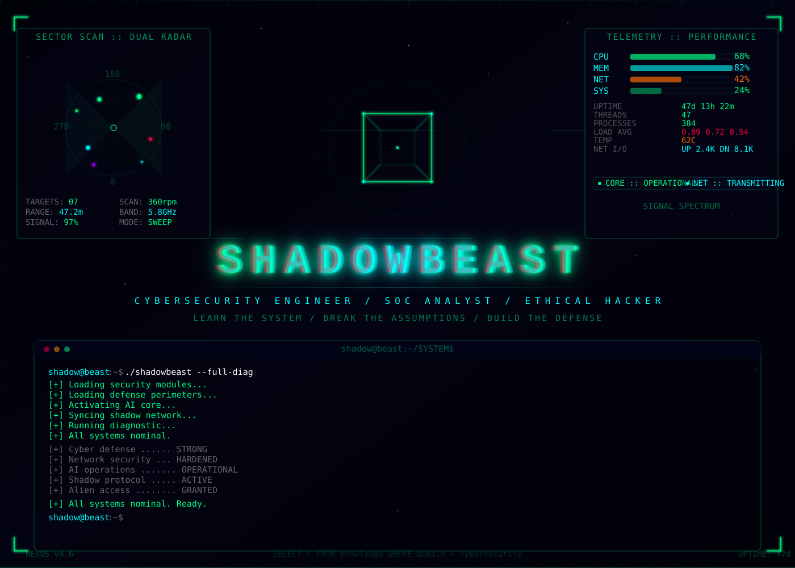
</picture>
<br>
<picture>
  <source media="(prefers-color-scheme: dark)" srcset="assets/nav-command.svg">
  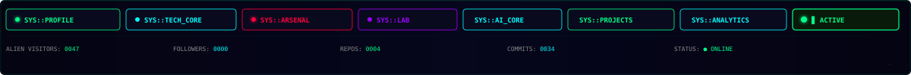
</picture>
<br>
<picture>
  <source media="(prefers-color-scheme: dark)" srcset="assets/skills-matrix-v2.svg">
  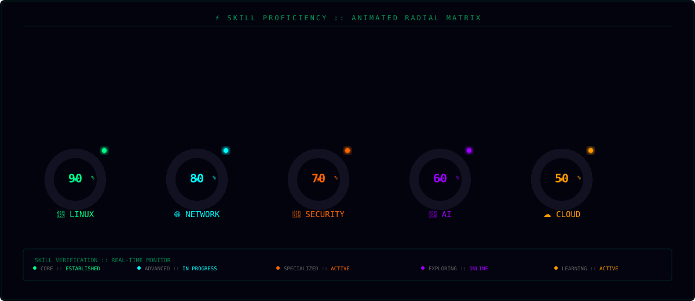
</picture>
<br>
<picture>
  <source media="(prefers-color-scheme: dark)" srcset="assets/sensor-feed.svg">
  
</picture>
<br>
<picture>
  <source media="(prefers-color-scheme: dark)" srcset="assets/core-directives.svg">
  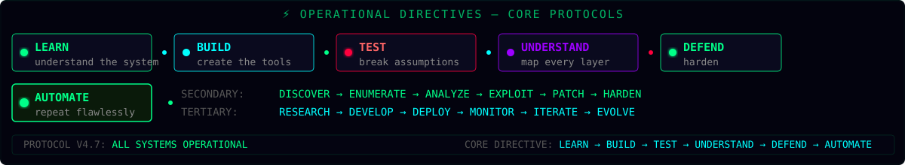
</picture>
<br>
<picture>
  <source media="(prefers-color-scheme: dark)" srcset="assets/attack-surface.svg">
  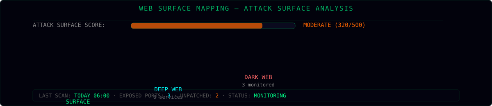
</picture>
<br>
<picture>
  <source media="(prefers-color-scheme: dark)" srcset="assets/threat-feed-tape.svg">
  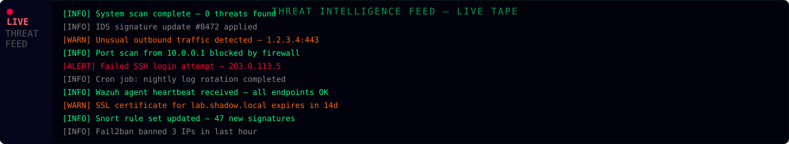
</picture>
<br>
<picture>
  <source media="(prefers-color-scheme: dark)" srcset="assets/pulse-network.svg">
  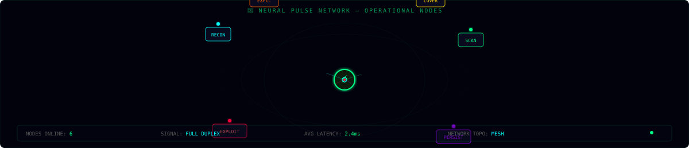
</picture>
<br>
<picture>
  <source media="(prefers-color-scheme: dark)" srcset="assets/boot-sequence.svg">
  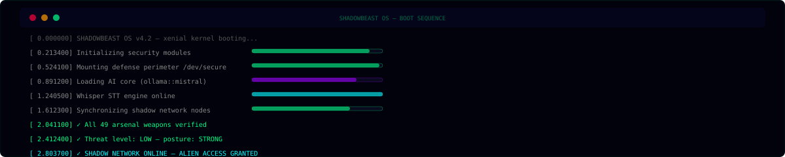
</picture>
<br>
<picture>
  <source media="(prefers-color-scheme: dark)" srcset="assets/resource-monitor.svg">
  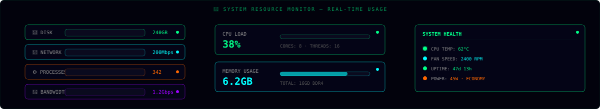
</picture>
<br>
<picture>
  <source media="(prefers-color-scheme: dark)" srcset="assets/risk-heatmap.svg">
  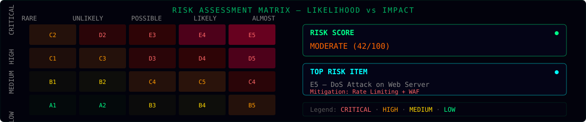
</picture>
<br>
<picture>
  <source media="(prefers-color-scheme: dark)" srcset="assets/arsenal-cards.svg">
  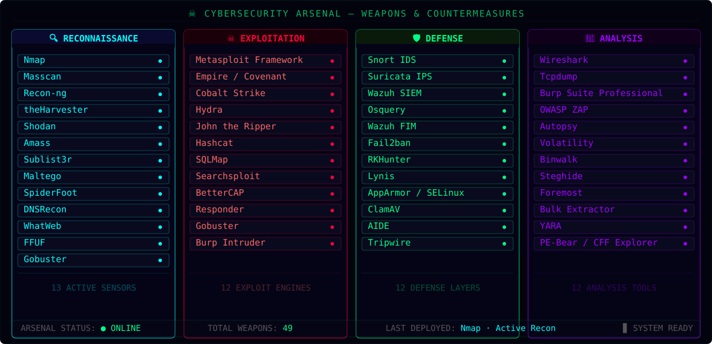
</picture>
<br>
<picture>
  <source media="(prefers-color-scheme: dark)" srcset="assets/threat-model.svg">
  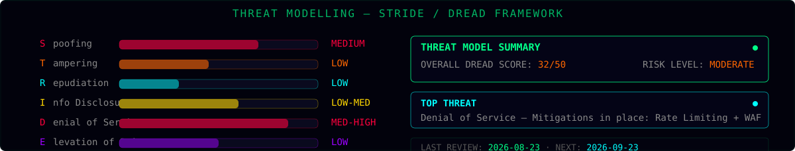
</picture>
<br>
<picture>
  <source media="(prefers-color-scheme: dark)" srcset="assets/forensics-timeline.svg">
  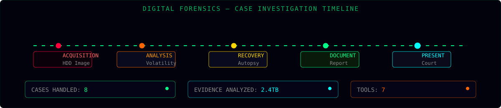
</picture>
<br>
<picture>
  <source media="(prefers-color-scheme: dark)" srcset="assets/battle-stations.svg">
  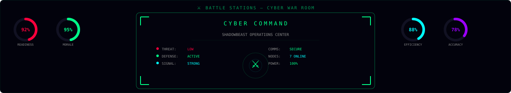
</picture>
<br>
<picture>
  <source media="(prefers-color-scheme: dark)" srcset="assets/password-audit.svg">
  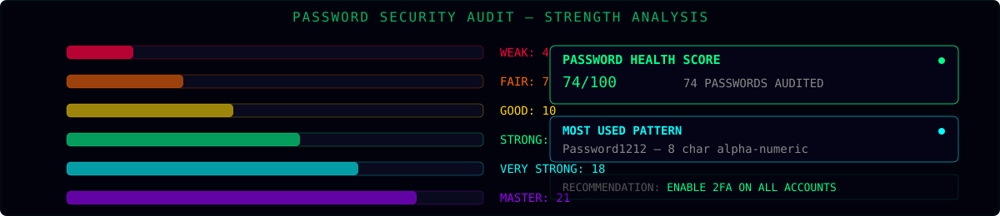
</picture>
<br>
<picture>
  <source media="(prefers-color-scheme: dark)" srcset="assets/tool-spotlight.svg">
  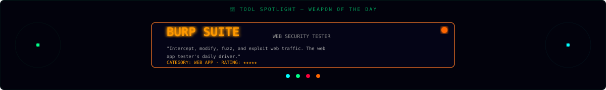
</picture>
<br>
<picture>
  <source media="(prefers-color-scheme: dark)" srcset="assets/tool-version-tracker.svg">
  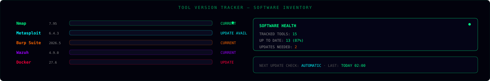
</picture>
<br>
<picture>
  <source media="(prefers-color-scheme: dark)" srcset="assets/tool-comparison.svg">
  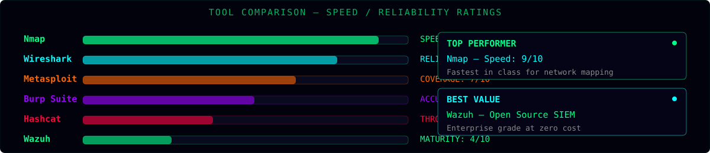
</picture>
<br>
<picture>
  <source media="(prefers-color-scheme: dark)" srcset="assets/dependency-graph.svg">
  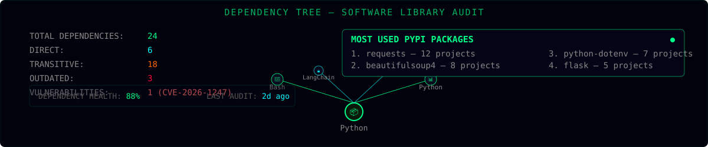
</picture>
<br>
<picture>
  <source media="(prefers-color-scheme: dark)" srcset="assets/deployment-pipeline.svg">
  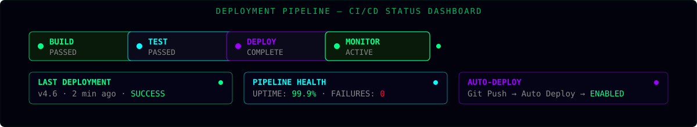
</picture>
<br>
<picture>
  <source media="(prefers-color-scheme: dark)" srcset="assets/zero-trust-arch.svg">
  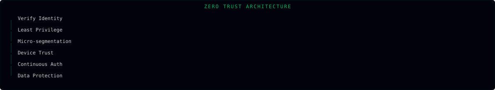
</picture>
<br>
<picture>
  <source media="(prefers-color-scheme: dark)" srcset="assets/encryption-layers.svg">
  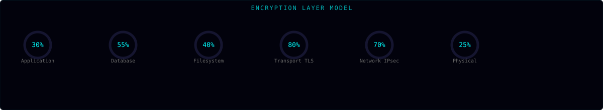
</picture>
<br>
<picture>
  <source media="(prefers-color-scheme: dark)" srcset="assets/iam-matrix.svg">
  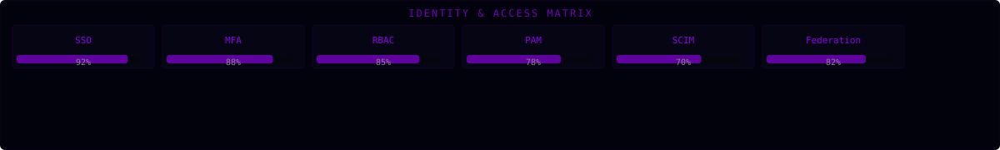
</picture>
<br>
<picture>
  <source media="(prefers-color-scheme: dark)" srcset="assets/malware-taxonomy.svg">
  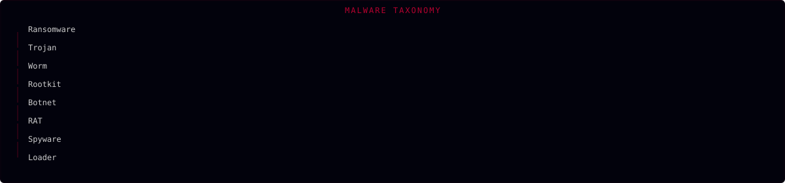
</picture>
<br>
<picture>
  <source media="(prefers-color-scheme: dark)" srcset="assets/phishing-campaign.svg">
  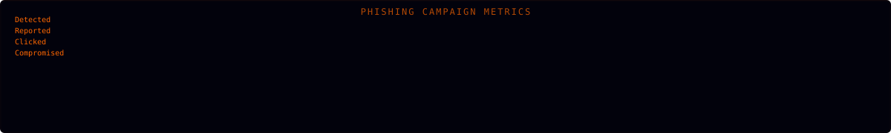
</picture>
<br>
<picture>
  <source media="(prefers-color-scheme: dark)" srcset="assets/ioc-dashboard.svg">
  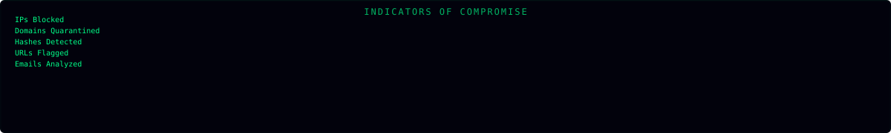
</picture>
<br>
<picture>
  <source media="(prefers-color-scheme: dark)" srcset="assets/network-topo-v2.svg">
  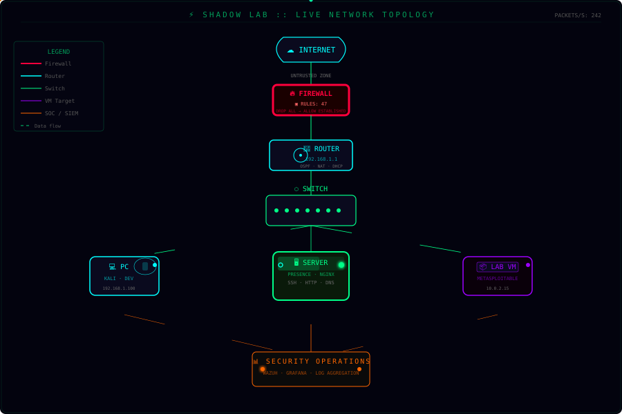
</picture>
<br>
<picture>
  <source media="(prefers-color-scheme: dark)" srcset="assets/network-latency.svg">
  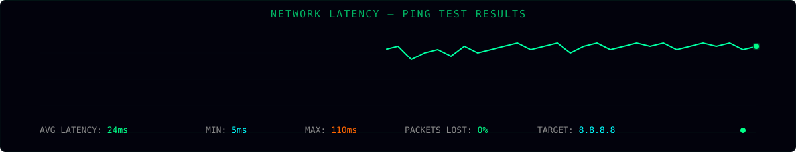
</picture>
<br>
<picture>
  <source media="(prefers-color-scheme: dark)" srcset="assets/learning-path.svg">
  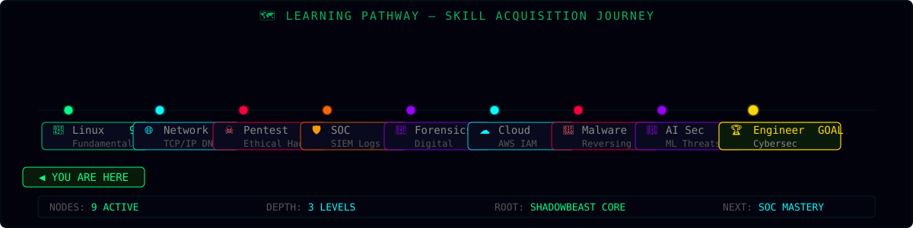
</picture>
<br>
<picture>
  <source media="(prefers-color-scheme: dark)" srcset="assets/skill-tree.svg">
  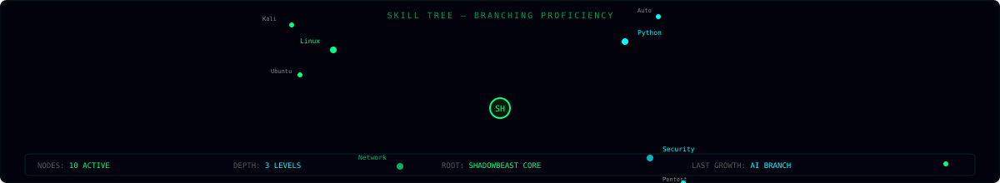
</picture>
<br>
<picture>
  <source media="(prefers-color-scheme: dark)" srcset="assets/threat-map.svg">
  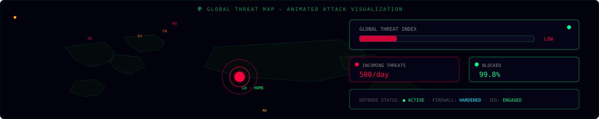
</picture>
<br>
<picture>
  <source media="(prefers-color-scheme: dark)" srcset="assets/incident-response.svg">
  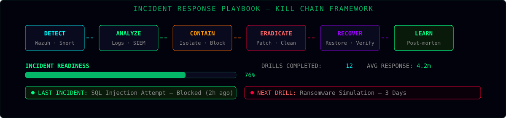
</picture>
<br>
<picture>
  <source media="(prefers-color-scheme: dark)" srcset="assets/defense-layers.svg">
  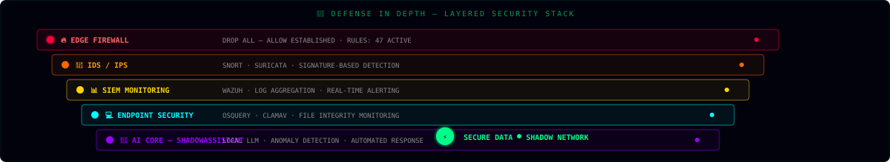
</picture>
<br>
<picture>
  <source media="(prefers-color-scheme: dark)" srcset="assets/red-team-cycle.svg">
  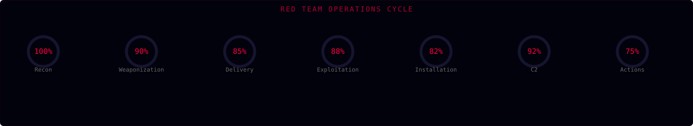
</picture>
<br>
<picture>
  <source media="(prefers-color-scheme: dark)" srcset="assets/exploit-dev.svg">
  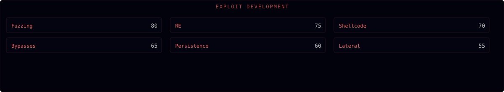
</picture>
<br>
<picture>
  <source media="(prefers-color-scheme: dark)" srcset="assets/adversary-emulation.svg">
  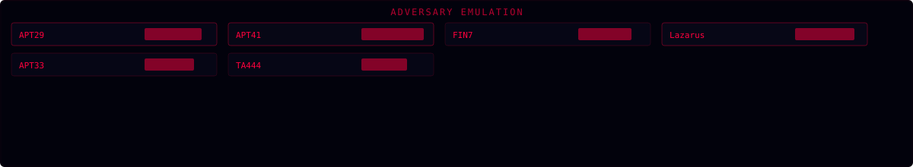
</picture>
<br>
<picture>
  <source media="(prefers-color-scheme: dark)" srcset="assets/blue-team-dashboard.svg">
  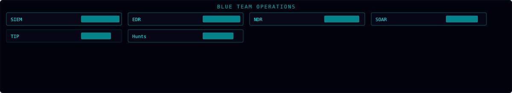
</picture>
<br>
<picture>
  <source media="(prefers-color-scheme: dark)" srcset="assets/hunt-operations.svg">
  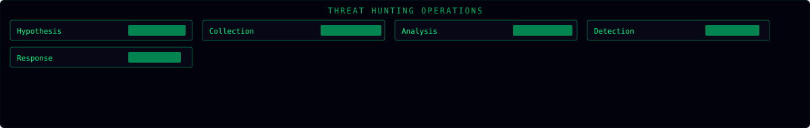
</picture>
<br>
<picture>
  <source media="(prefers-color-scheme: dark)" srcset="assets/purple-team-score.svg">
  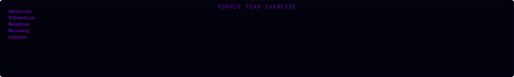
</picture>
<br>
<picture>
  <source media="(prefers-color-scheme: dark)" srcset="assets/dfir-workflow.svg">
  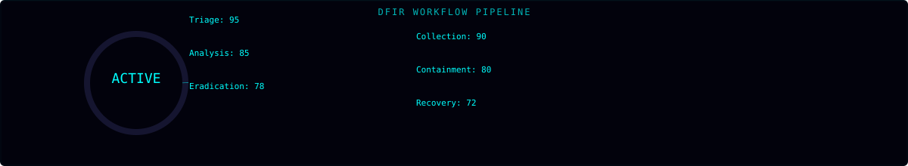
</picture>
<br>
<picture>
  <source media="(prefers-color-scheme: dark)" srcset="assets/memory-forensics.svg">
  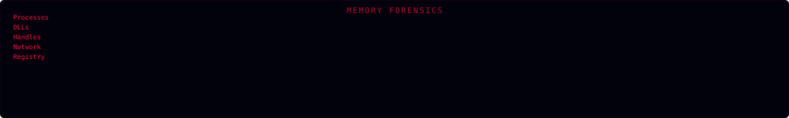
</picture>
<br>
<picture>
  <source media="(prefers-color-scheme: dark)" srcset="assets/disk-forensics.svg">
  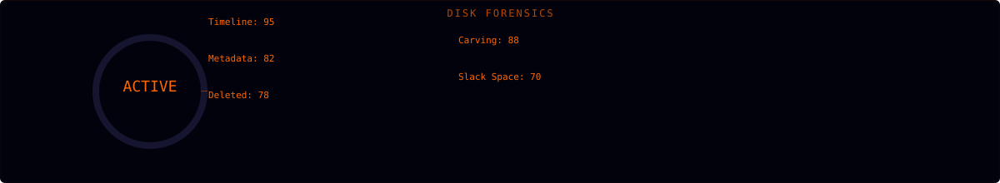
</picture>
<br>
<picture>
  <source media="(prefers-color-scheme: dark)" srcset="assets/chain-of-custody.svg">
  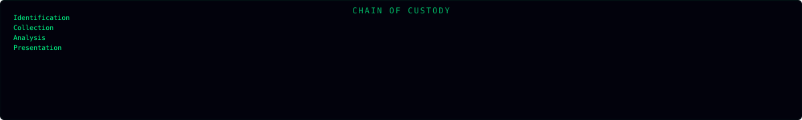
</picture>
<br>
<picture>
  <source media="(prefers-color-scheme: dark)" srcset="assets/mitre-attack-matrix.svg">
  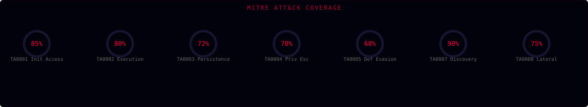
</picture>
<br>
<picture>
  <source media="(prefers-color-scheme: dark)" srcset="assets/cyber-kill-chain.svg">
  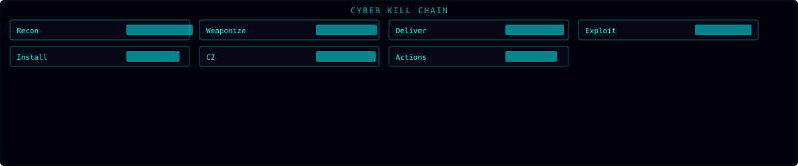
</picture>
<br>
<picture>
  <source media="(prefers-color-scheme: dark)" srcset="assets/diamond-model.svg">
  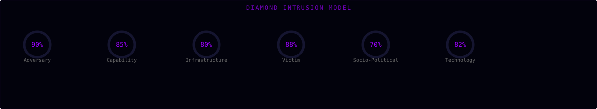
</picture>
<br>
<picture>
  <source media="(prefers-color-scheme: dark)" srcset="assets/threat-intel-cycle.svg">
  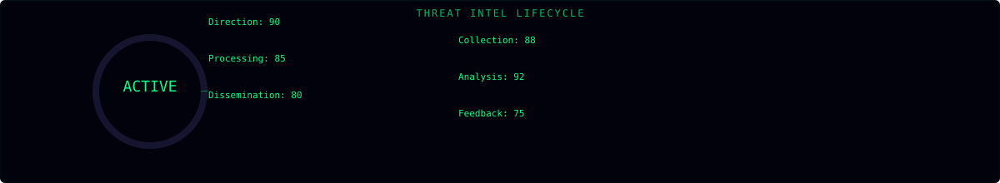
</picture>
<br>
<picture>
  <source media="(prefers-color-scheme: dark)" srcset="assets/projects-dashboard.svg">
  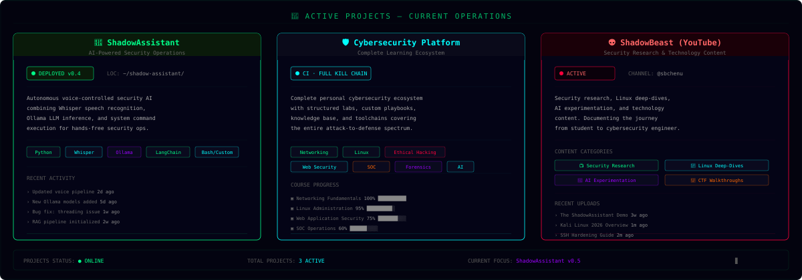
</picture>
<br>
<picture>
  <source media="(prefers-color-scheme: dark)" srcset="assets/ai-pipeline.svg">
  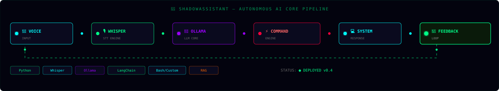
</picture>
<br>
<picture>
  <source media="(prefers-color-scheme: dark)" srcset="assets/tech-cloud.svg">
  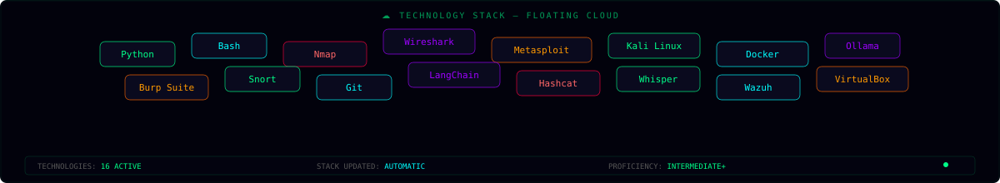
</picture>
<br>
<picture>
  <source media="(prefers-color-scheme: dark)" srcset="assets/os-usage-pie.svg">
  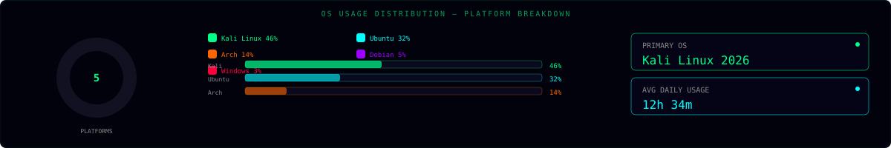
</picture>
<br>
<picture>
  <source media="(prefers-color-scheme: dark)" srcset="assets/compliance-audit.svg">
  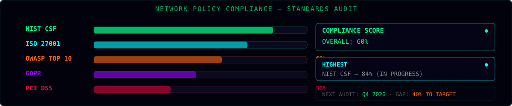
</picture>
<br>
<picture>
  <source media="(prefers-color-scheme: dark)" srcset="assets/vuln-management.svg">
  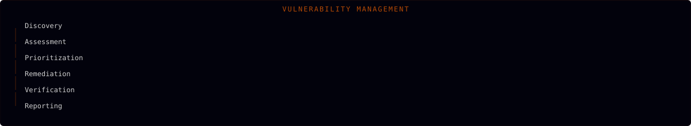
</picture>
<br>
<picture>
  <source media="(prefers-color-scheme: dark)" srcset="assets/patch-cycles.svg">
  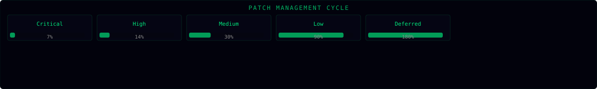
</picture>
<br>
<picture>
  <source media="(prefers-color-scheme: dark)" srcset="assets/cve-tracker.svg">
  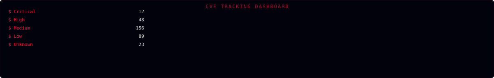
</picture>
<br>
<picture>
  <source media="(prefers-color-scheme: dark)" srcset="assets/nist-framework.svg">
  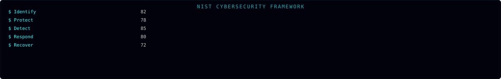
</picture>
<br>
<picture>
  <source media="(prefers-color-scheme: dark)" srcset="assets/iso-27001-controls.svg">
  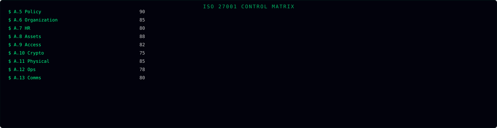
</picture>
<br>
<picture>
  <source media="(prefers-color-scheme: dark)" srcset="assets/cmmc-maturity.svg">
  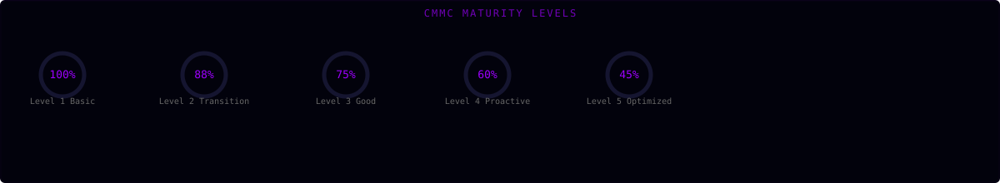
</picture>
<br>
<picture>
  <source media="(prefers-color-scheme: dark)" srcset="assets/compliance-mapping.svg">
  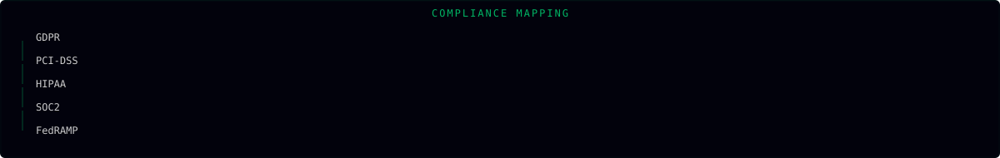
</picture>
<br>
<picture>
  <source media="(prefers-color-scheme: dark)" srcset="assets/audit-trail.svg">
  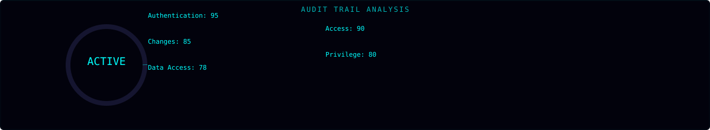
</picture>
<br>
<picture>
  <source media="(prefers-color-scheme: dark)" srcset="assets/data-classification.svg">
  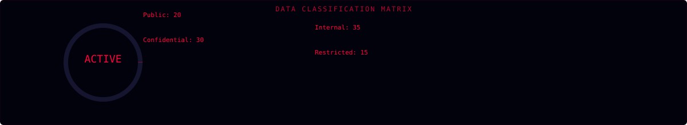
</picture>
<br>
<picture>
  <source media="(prefers-color-scheme: dark)" srcset="assets/roadmap-timeline.svg">
  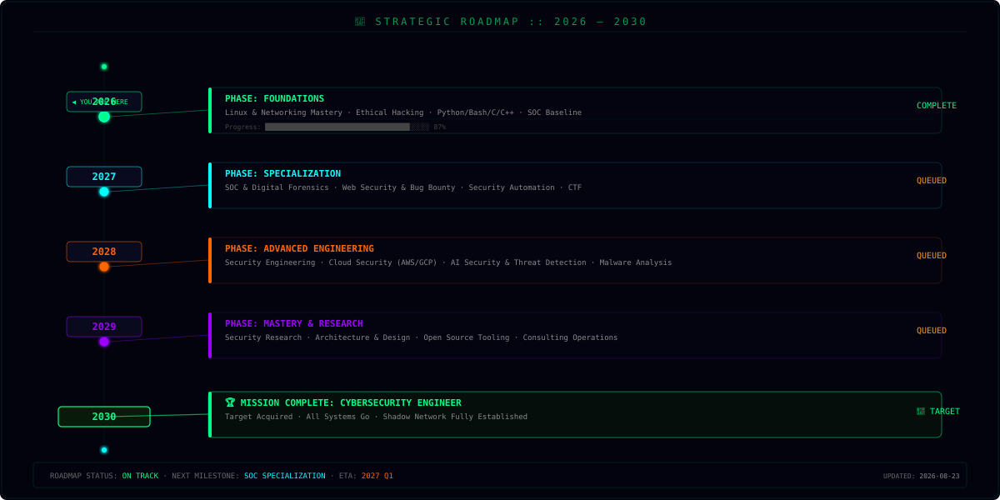
</picture>
<br>
<picture>
  <source media="(prefers-color-scheme: dark)" srcset="assets/cert-tracker.svg">
  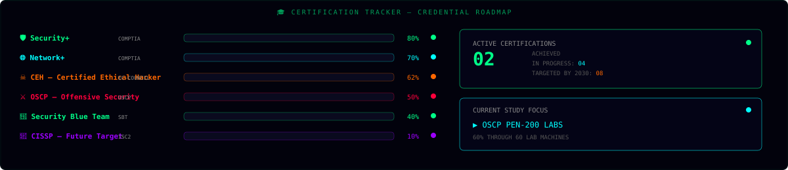
</picture>
<br>
<picture>
  <source media="(prefers-color-scheme: dark)" srcset="assets/ctf-scoreboard.svg">
  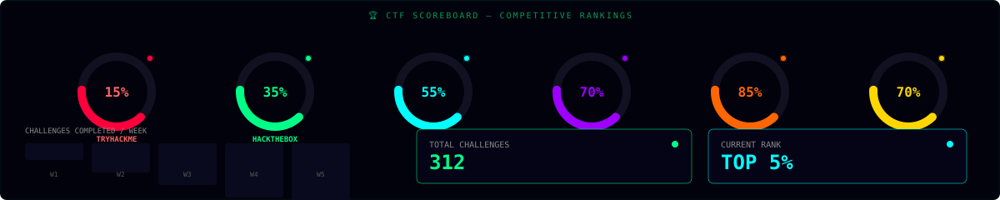
</picture>
<br>
<picture>
  <source media="(prefers-color-scheme: dark)" srcset="assets/bug-bounty.svg">
  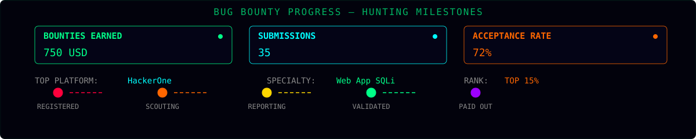
</picture>
<br>
<picture>
  <source media="(prefers-color-scheme: dark)" srcset="assets/learning-vector.svg">
  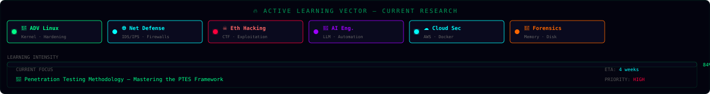
</picture>
<br>
<picture>
  <source media="(prefers-color-scheme: dark)" srcset="assets/learning-hours.svg">
  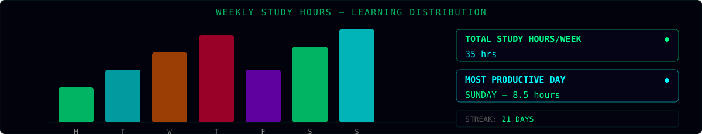
</picture>
<br>
<picture>
  <source media="(prefers-color-scheme: dark)" srcset="assets/vuln-timeline.svg">
  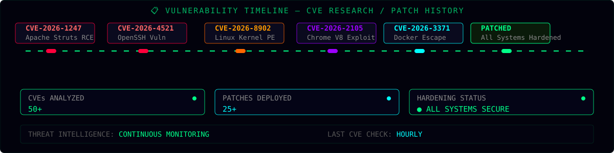
</picture>
<br>
<picture>
  <source media="(prefers-color-scheme: dark)" srcset="assets/vulnerability-severity.svg">
  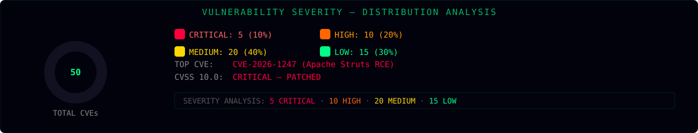
</picture>
<br>
<picture>
  <source media="(prefers-color-scheme: dark)" srcset="assets/live-ticker.svg">
  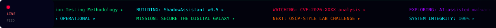
</picture>
<br>
<picture>
  <source media="(prefers-color-scheme: dark)" srcset="assets/activity-heatmap.svg">
  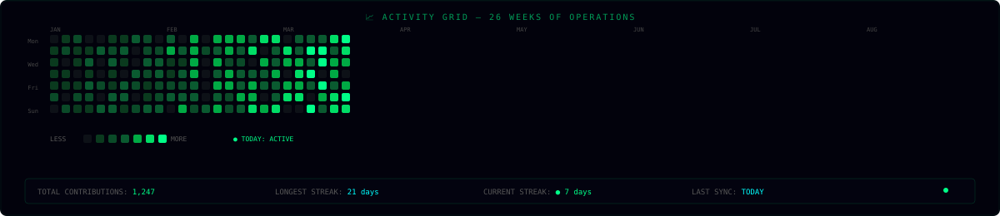
</picture>
<br>
<picture>
  <source media="(prefers-color-scheme: dark)" srcset="assets/weekly-commit-chart.svg">
  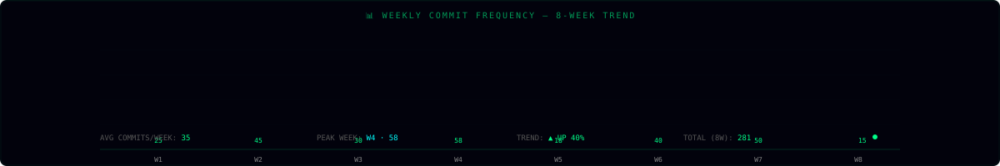
</picture>
<br>
<picture>
  <source media="(prefers-color-scheme: dark)" srcset="assets/monthly-progress.svg">
  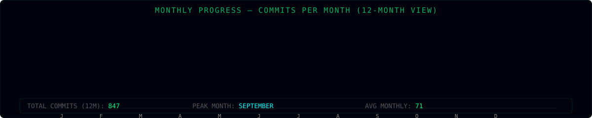
</picture>
<br>
<picture>
  <source media="(prefers-color-scheme: dark)" srcset="assets/code-activity-heatmap-year.svg">
  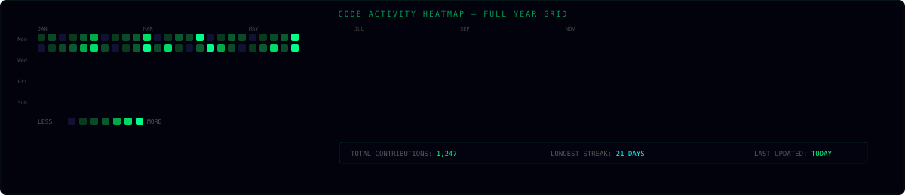
</picture>
<br>
<picture>
  <source media="(prefers-color-scheme: dark)" srcset="assets/snake-wrapper.svg">
  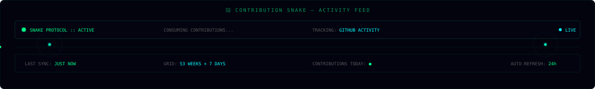
</picture>
<br>
<picture>
  <source media="(prefers-color-scheme: dark)" srcset="assets/github-metrics.svg">
  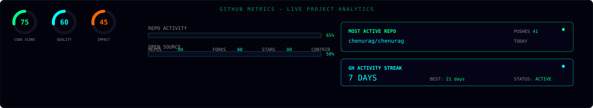
</picture>
<br>
<picture>
  <source media="(prefers-color-scheme: dark)" srcset="assets/project-timeline.svg">
  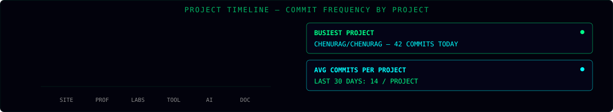
</picture>
<br>
<picture>
  <source media="(prefers-color-scheme: dark)" srcset="assets/project-milestones.svg">
  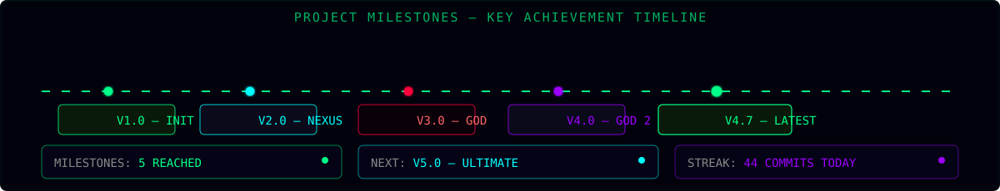
</picture>
<br>
<picture>
  <source media="(prefers-color-scheme: dark)" srcset="assets/github-stats-frame.svg">
  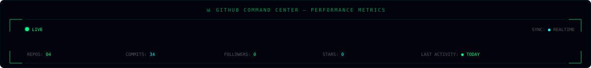
</picture>
<br>
<picture>
  <source media="(prefers-color-scheme: dark)" srcset="assets/level-system.svg">
  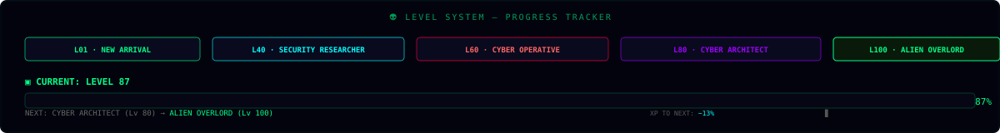
</picture>
<br>
<picture>
  <source media="(prefers-color-scheme: dark)" srcset="assets/self-audit-scorecard.svg">
  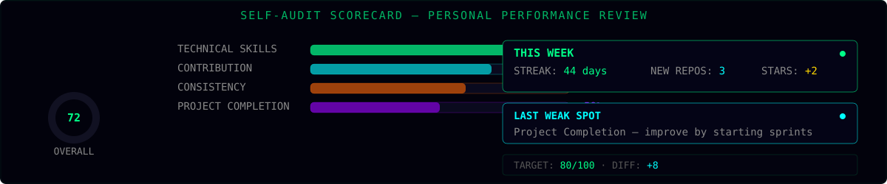
</picture>
<br>
<picture>
  <source media="(prefers-color-scheme: dark)" srcset="assets/counter-dashboard.svg">
  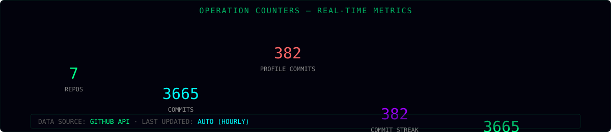
</picture>
<br>
<picture>
  <source media="(prefers-color-scheme: dark)" srcset="assets/system-scan-result.svg">
  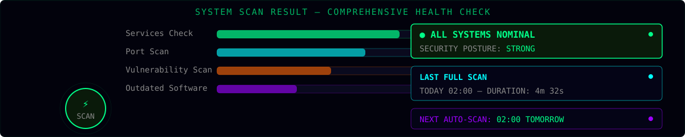
</picture>
<br>
<picture>
  <source media="(prefers-color-scheme: dark)" srcset="assets/protocol-badges.svg">
  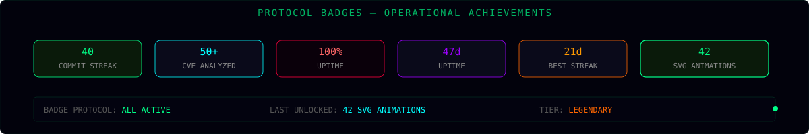
</picture>
<br>
<picture>
  <source media="(prefers-color-scheme: dark)" srcset="assets/code-stats.svg">
  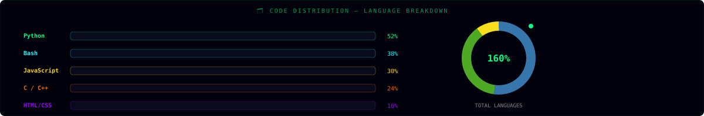
</picture>
<br>
<picture>
  <source media="(prefers-color-scheme: dark)" srcset="assets/code-quality.svg">
  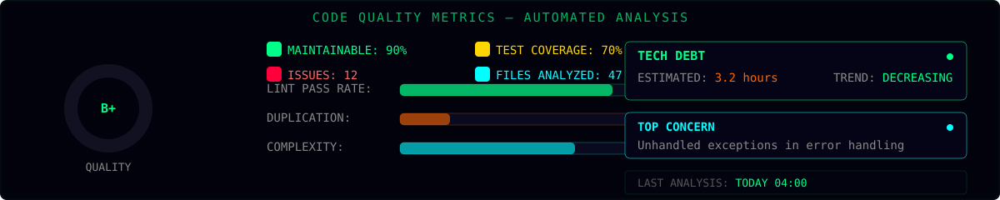
</picture>
<br>
<picture>
  <source media="(prefers-color-scheme: dark)" srcset="assets/tech-radar-chart.svg">
  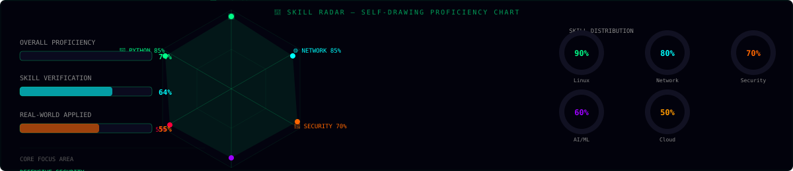
</picture>
<br>
<picture>
  <source media="(prefers-color-scheme: dark)" srcset="assets/knowledge-base.svg">
  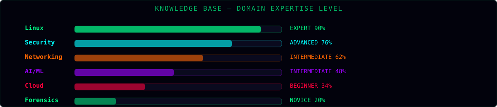
</picture>
<br>
<picture>
  <source media="(prefers-color-scheme: dark)" srcset="assets/data-breakdown.svg">
  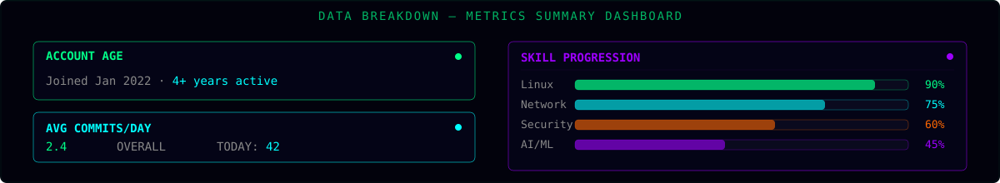
</picture>
<br>
<picture>
  <source media="(prefers-color-scheme: dark)" srcset="assets/terminal-session.svg">
  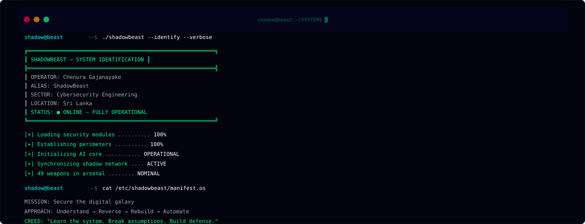
</picture>
<br>
<picture>
  <source media="(prefers-color-scheme: dark)" srcset="assets/log-analysis.svg">
  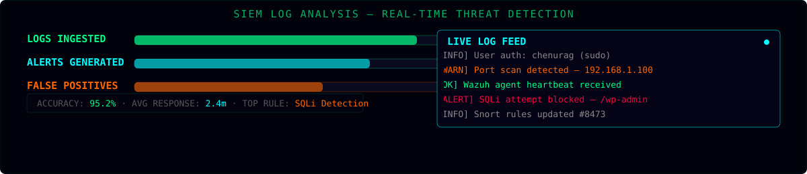
</picture>
<br>
<picture>
  <source media="(prefers-color-scheme: dark)" srcset="assets/cloud-security-pillars.svg">
  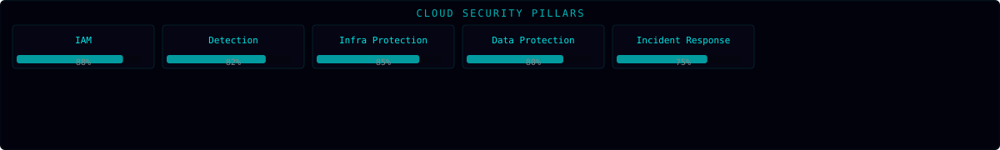
</picture>
<br>
<picture>
  <source media="(prefers-color-scheme: dark)" srcset="assets/container-security.svg">
  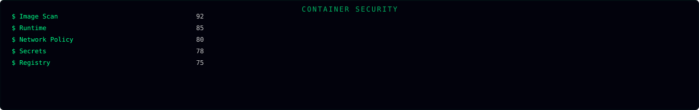
</picture>
<br>
<picture>
  <source media="(prefers-color-scheme: dark)" srcset="assets/devsecops-pipeline.svg">
  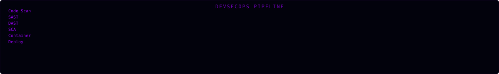
</picture>
<br>
<picture>
  <source media="(prefers-color-scheme: dark)" srcset="assets/api-security-matrix.svg">
  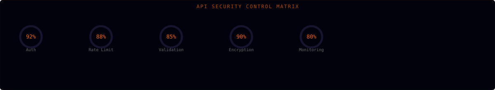
</picture>
<br>
<picture>
  <source media="(prefers-color-scheme: dark)" srcset="assets/supply-chain-sec.svg">
  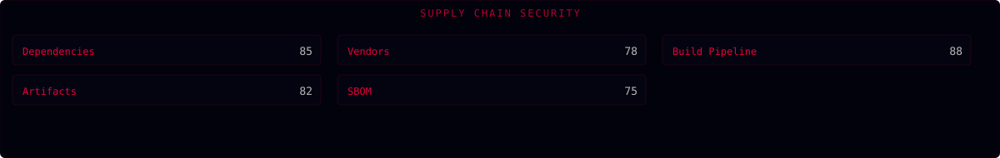
</picture>
<br>
<picture>
  <source media="(prefers-color-scheme: dark)" srcset="assets/aws-security.svg">
  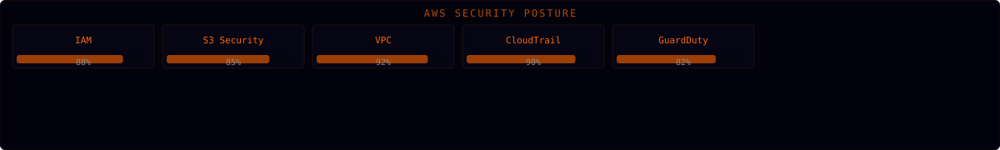
</picture>
<br>
<picture>
  <source media="(prefers-color-scheme: dark)" srcset="assets/azure-security.svg">
  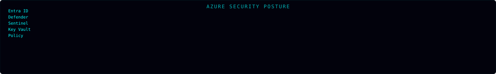
</picture>
<br>
<picture>
  <source media="(prefers-color-scheme: dark)" srcset="assets/gcp-security.svg">
  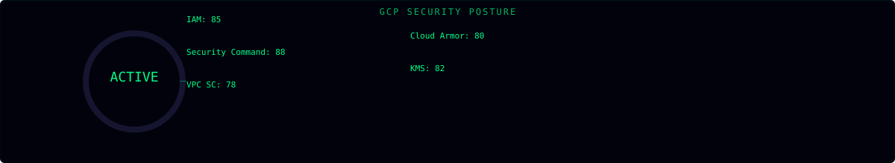
</picture>
<br>
<picture>
  <source media="(prefers-color-scheme: dark)" srcset="assets/k8s-security.svg">
  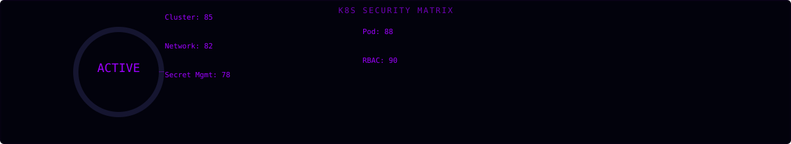
</picture>
<br>
<picture>
  <source media="(prefers-color-scheme: dark)" srcset="assets/serverless-sec.svg">
  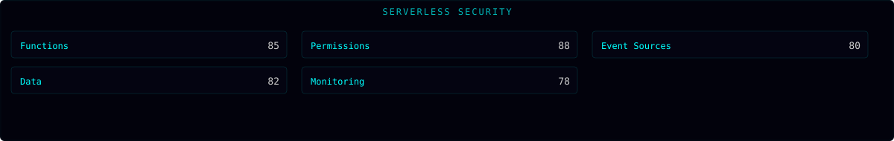
</picture>
<br>
<picture>
  <source media="(prefers-color-scheme: dark)" srcset="assets/terraform-sec.svg">
  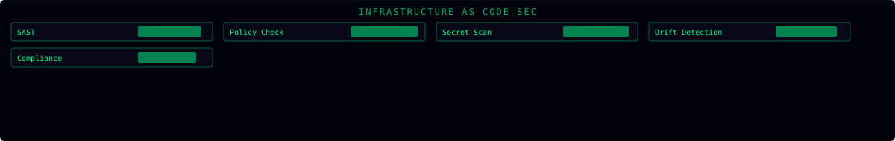
</picture>
<br>
<picture>
  <source media="(prefers-color-scheme: dark)" srcset="assets/crypto-overview.svg">
  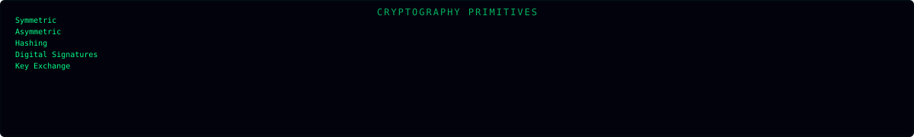
</picture>
<br>
<picture>
  <source media="(prefers-color-scheme: dark)" srcset="assets/hash-algorithms.svg">
  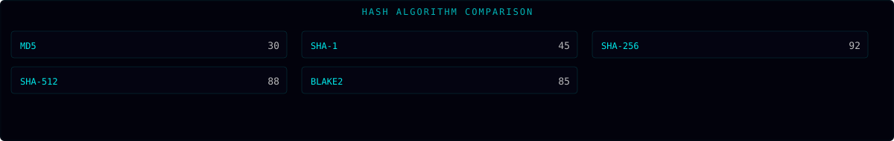
</picture>
<br>
<picture>
  <source media="(prefers-color-scheme: dark)" srcset="assets/steganography-panel.svg">
  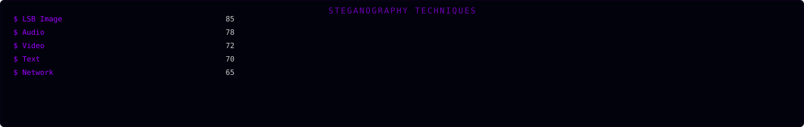
</picture>
<br>
<picture>
  <source media="(prefers-color-scheme: dark)" srcset="assets/certificate-mgmt.svg">
  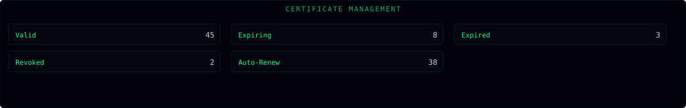
</picture>
<br>
<picture>
  <source media="(prefers-color-scheme: dark)" srcset="assets/public-key-infra.svg">
  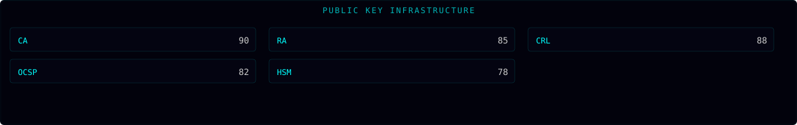
</picture>
<br>
<picture>
  <source media="(prefers-color-scheme: dark)" srcset="assets/key-management.svg">
  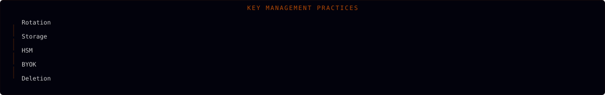
</picture>
<br>
<picture>
  <source media="(prefers-color-scheme: dark)" srcset="assets/tls-config.svg">
  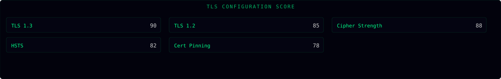
</picture>
<br>
<picture>
  <source media="(prefers-color-scheme: dark)" srcset="assets/soc-tier-model.svg">
  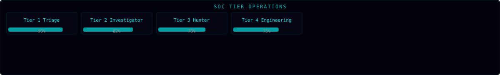
</picture>
<br>
<picture>
  <source media="(prefers-color-scheme: dark)" srcset="assets/siem-dashboard.svg">
  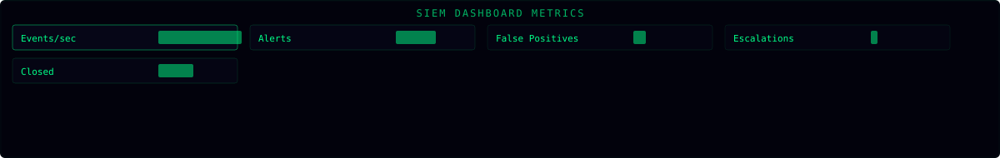
</picture>
<br>
<picture>
  <source media="(prefers-color-scheme: dark)" srcset="assets/soar-playbooks.svg">
  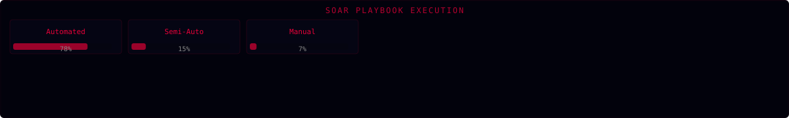
</picture>
<br>
<picture>
  <source media="(prefers-color-scheme: dark)" srcset="assets/alert-triage-panel.svg">
  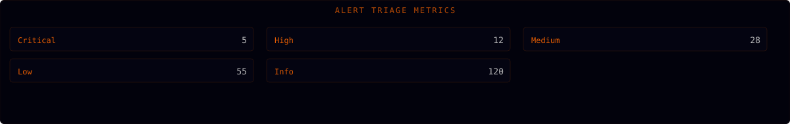
</picture>
<br>
<picture>
  <source media="(prefers-color-scheme: dark)" srcset="assets/soc-metrics.svg">
  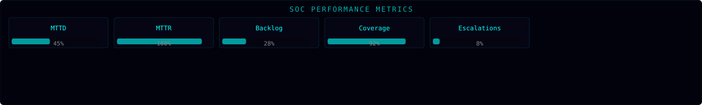
</picture>
<br>
<picture>
  <source media="(prefers-color-scheme: dark)" srcset="assets/tier-1-metrics.svg">
  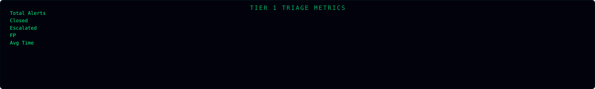
</picture>
<br>
<picture>
  <source media="(prefers-color-scheme: dark)" srcset="assets/tier-2-metrics.svg">
  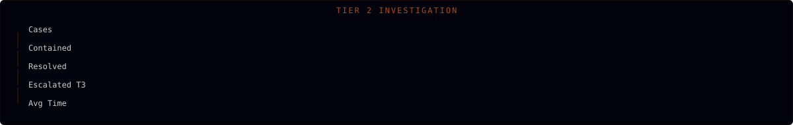
</picture>
<br>
<picture>
  <source media="(prefers-color-scheme: dark)" srcset="assets/tier-3-metrics.svg">
  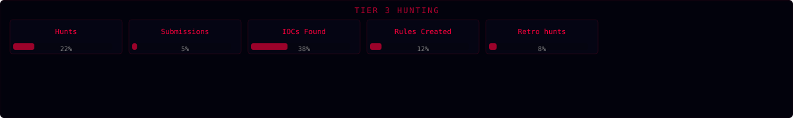
</picture>
<br>
<picture>
  <source media="(prefers-color-scheme: dark)" srcset="assets/shift-handover.svg">
  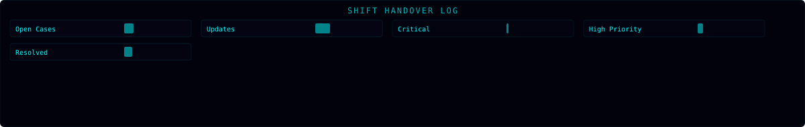
</picture>
<br>
<picture>
  <source media="(prefers-color-scheme: dark)" srcset="assets/network-segmentation.svg">
  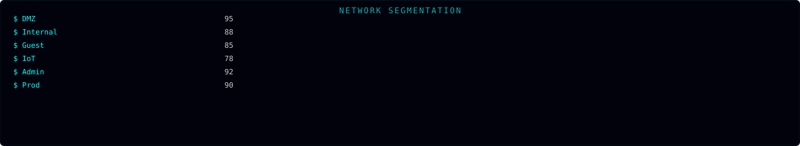
</picture>
<br>
<picture>
  <source media="(prefers-color-scheme: dark)" srcset="assets/firewall-ruleset.svg">
  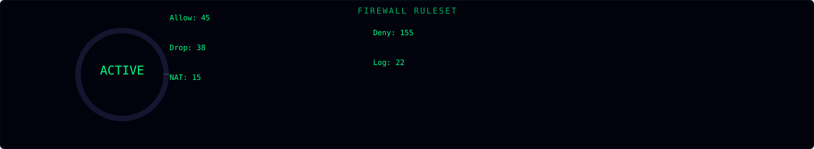
</picture>
<br>
<picture>
  <source media="(prefers-color-scheme: dark)" srcset="assets/wireless-security.svg">
  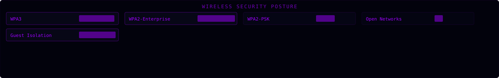
</picture>
<br>
<picture>
  <source media="(prefers-color-scheme: dark)" srcset="assets/osi-layers.svg">
  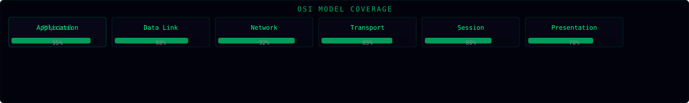
</picture>
<br>
<picture>
  <source media="(prefers-color-scheme: dark)" srcset="assets/tcpip-stack.svg">
  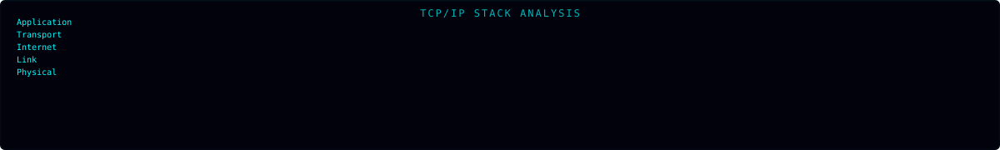
</picture>
<br>
<picture>
  <source media="(prefers-color-scheme: dark)" srcset="assets/protocol-analysis.svg">
  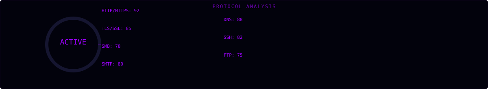
</picture>
<br>
<picture>
  <source media="(prefers-color-scheme: dark)" srcset="assets/packet-capture.svg">
  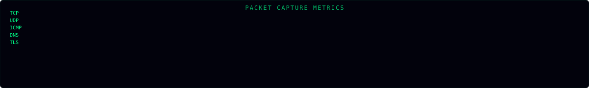
</picture>
<br>
<picture>
  <source media="(prefers-color-scheme: dark)" srcset="assets/bandwidth-mon.svg">
  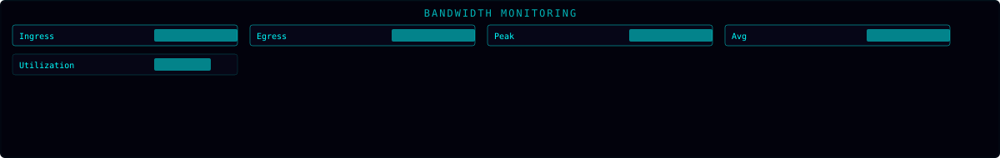
</picture>
<br>
<picture>
  <source media="(prefers-color-scheme: dark)" srcset="assets/dns-security.svg">
  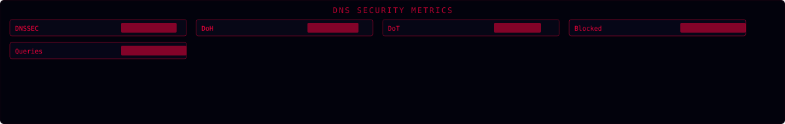
</picture>
<br>
<picture>
  <source media="(prefers-color-scheme: dark)" srcset="assets/vpn-tunnel.svg">
  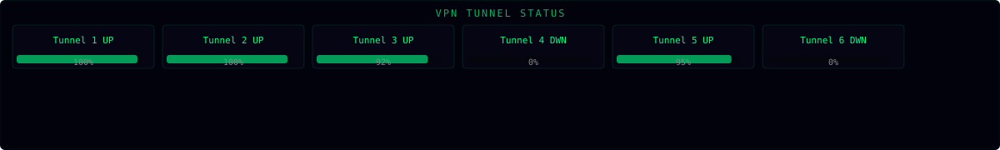
</picture>
<br>
<picture>
  <source media="(prefers-color-scheme: dark)" srcset="assets/load-balancer.svg">
  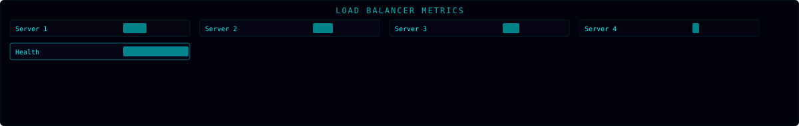
</picture>
<br>
<picture>
  <source media="(prefers-color-scheme: dark)" srcset="assets/cdn-performance.svg">
  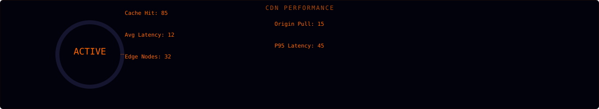
</picture>
<br>
<picture>
  <source media="(prefers-color-scheme: dark)" srcset="assets/nat-traffic.svg">
  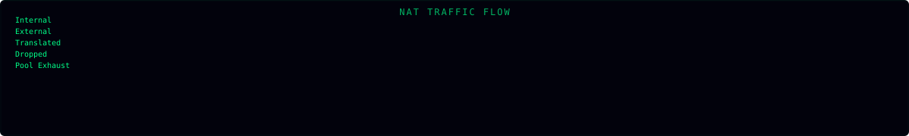
</picture>
<br>
<picture>
  <source media="(prefers-color-scheme: dark)" srcset="assets/social-engineering.svg">
  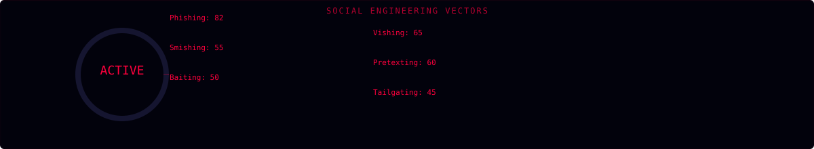
</picture>
<br>
<picture>
  <source media="(prefers-color-scheme: dark)" srcset="assets/security-awareness.svg">
  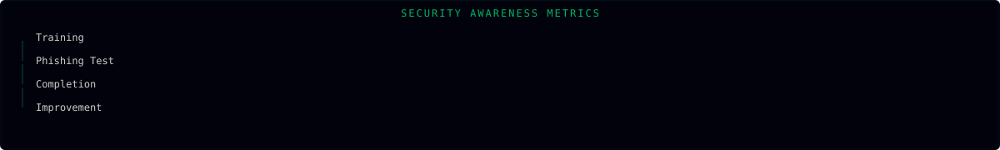
</picture>
<br>
<picture>
  <source media="(prefers-color-scheme: dark)" srcset="assets/tabletop-exercise.svg">
  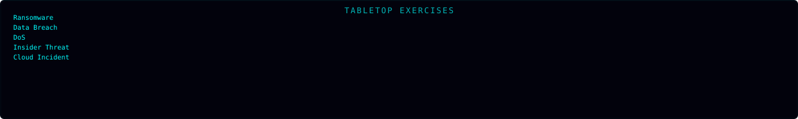
</picture>
<br>
<picture>
  <source media="(prefers-color-scheme: dark)" srcset="assets/phishing-campaign-mgr.svg">
  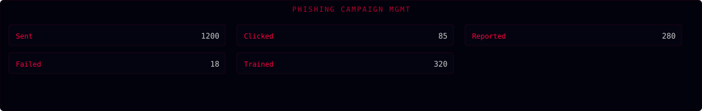
</picture>
<br>
<picture>
  <source media="(prefers-color-scheme: dark)" srcset="assets/security-training.svg">
  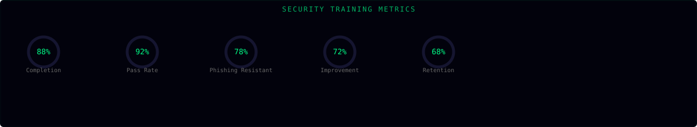
</picture>
<br>
<picture>
  <source media="(prefers-color-scheme: dark)" srcset="assets/certification-progress.svg">
  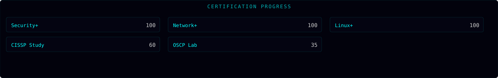
</picture>
<br>
<picture>
  <source media="(prefers-color-scheme: dark)" srcset="assets/risk-assessment-panel.svg">
  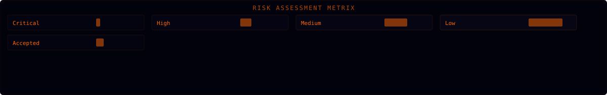
</picture>
<br>
<picture>
  <source media="(prefers-color-scheme: dark)" srcset="assets/business-impact.svg">
  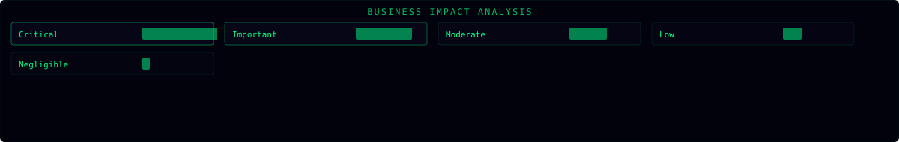
</picture>
<br>
<picture>
  <source media="(prefers-color-scheme: dark)" srcset="assets/disaster-recovery.svg">
  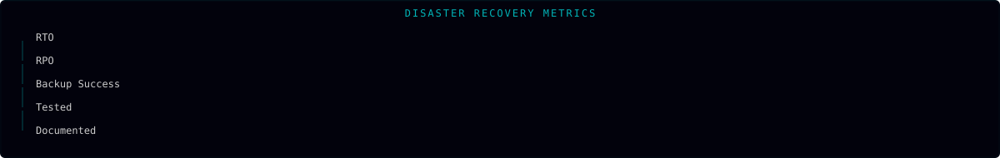
</picture>
<br>
<picture>
  <source media="(prefers-color-scheme: dark)" srcset="assets/business-continuity.svg">
  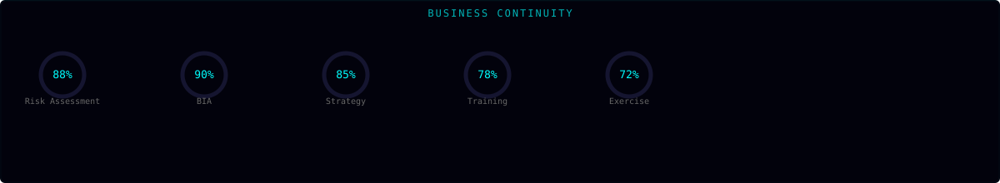
</picture>
<br>
<picture>
  <source media="(prefers-color-scheme: dark)" srcset="assets/risk-register.svg">
  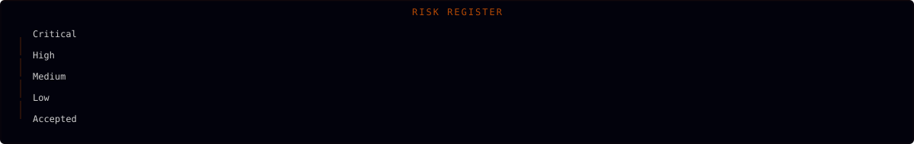
</picture>
<br>
<picture>
  <source media="(prefers-color-scheme: dark)" srcset="assets/third-party-risk.svg">
  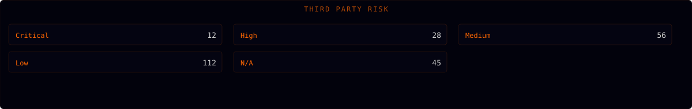
</picture>
<br>
<picture>
  <source media="(prefers-color-scheme: dark)" srcset="assets/vendor-assessment.svg">
  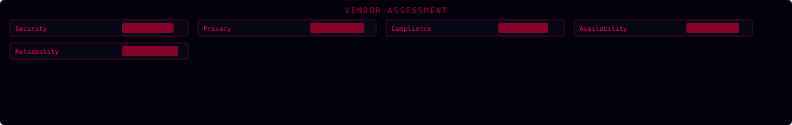
</picture>
<br>
<picture>
  <source media="(prefers-color-scheme: dark)" srcset="assets/policy-framework.svg">
  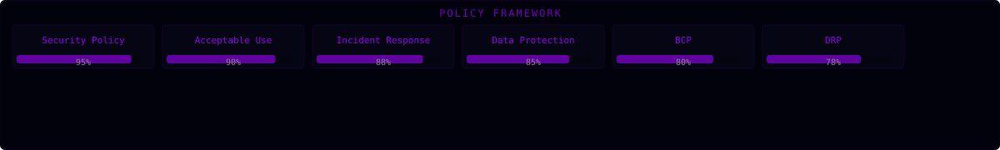
</picture>
<br>
<picture>
  <source media="(prefers-color-scheme: dark)" srcset="assets/data-governance.svg">
  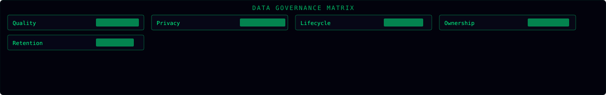
</picture>
<br>
<picture>
  <source media="(prefers-color-scheme: dark)" srcset="assets/dlp-overview.svg">
  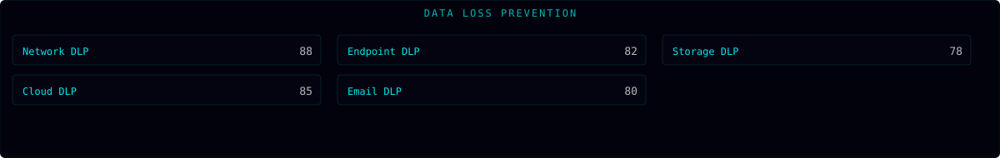
</picture>
<br>
<picture>
  <source media="(prefers-color-scheme: dark)" srcset="assets/grc-dashboard.svg">
  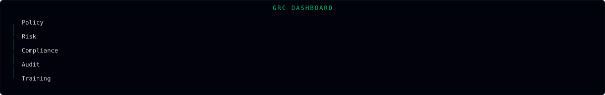
</picture>
<br>
<picture>
  <source media="(prefers-color-scheme: dark)" srcset="assets/gdpr-matrix.svg">
  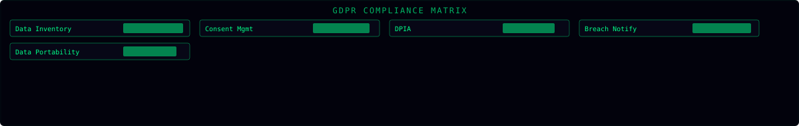
</picture>
<br>
<picture>
  <source media="(prefers-color-scheme: dark)" srcset="assets/pci-dss-controls.svg">
  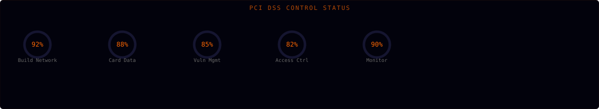
</picture>
<br>
<picture>
  <source media="(prefers-color-scheme: dark)" srcset="assets/hipaa-safeguards.svg">
  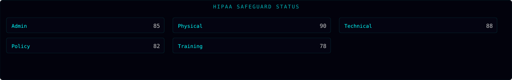
</picture>
<br>
<picture>
  <source media="(prefers-color-scheme: dark)" srcset="assets/sox-controls.svg">
  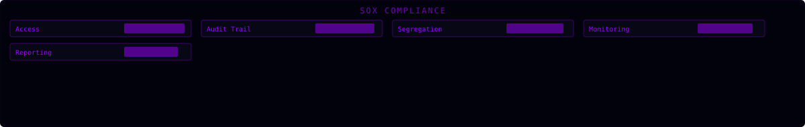
</picture>
<br>
<picture>
  <source media="(prefers-color-scheme: dark)" srcset="assets/fedramp-levels.svg">
  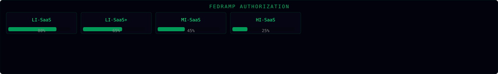
</picture>
<br>
<picture>
  <source media="(prefers-color-scheme: dark)" srcset="assets/compliance-mapping.svg">
  
</picture>
<br>
<picture>
  <source media="(prefers-color-scheme: dark)" srcset="assets/pentest-methodology.svg">
  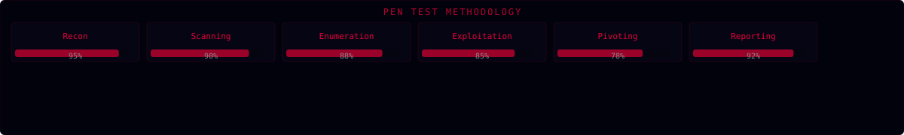
</picture>
<br>
<picture>
  <source media="(prefers-color-scheme: dark)" srcset="assets/web-app-pentest.svg">
  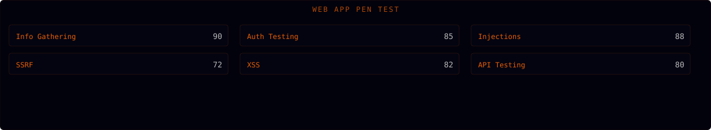
</picture>
<br>
<picture>
  <source media="(prefers-color-scheme: dark)" srcset="assets/mobile-pentest.svg">
  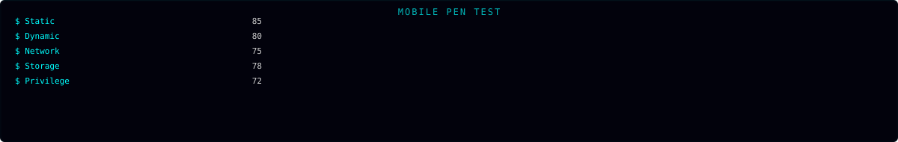
</picture>
<br>
<picture>
  <source media="(prefers-color-scheme: dark)" srcset="assets/owasp-top10.svg">
  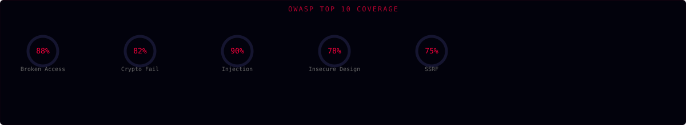
</picture>
<br>
<picture>
  <source media="(prefers-color-scheme: dark)" srcset="assets/sast-coverage.svg">
  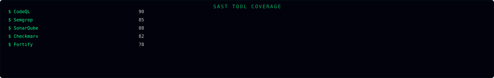
</picture>
<br>
<picture>
  <source media="(prefers-color-scheme: dark)" srcset="assets/dast-coverage.svg">
  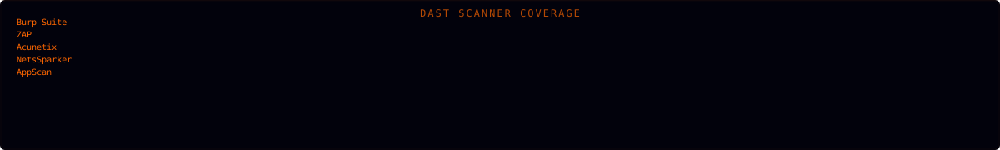
</picture>
<br>
<picture>
  <source media="(prefers-color-scheme: dark)" srcset="assets/sca-metrics.svg">
  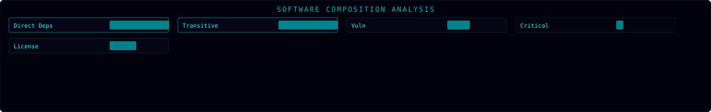
</picture>
<br>
<picture>
  <source media="(prefers-color-scheme: dark)" srcset="assets/active-defense.svg">
  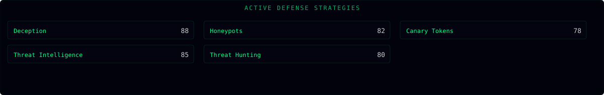
</picture>
<br>
<picture>
  <source media="(prefers-color-scheme: dark)" srcset="assets/deception-tech.svg">
  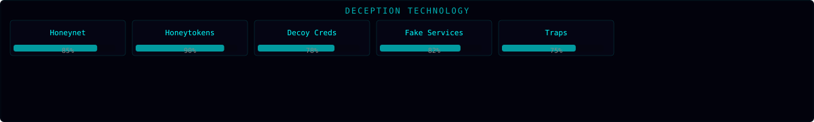
</picture>
<br>
<picture>
  <source media="(prefers-color-scheme: dark)" srcset="assets/sandbox-analysis.svg">
  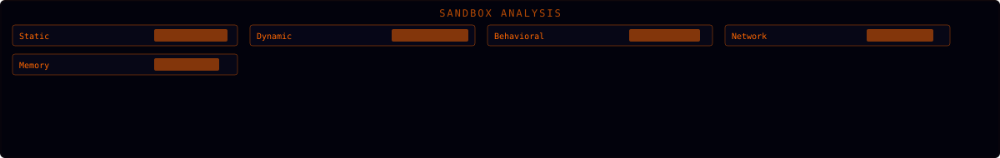
</picture>
<br>
<picture>
  <source media="(prefers-color-scheme: dark)" srcset="assets/yara-rules.svg">
  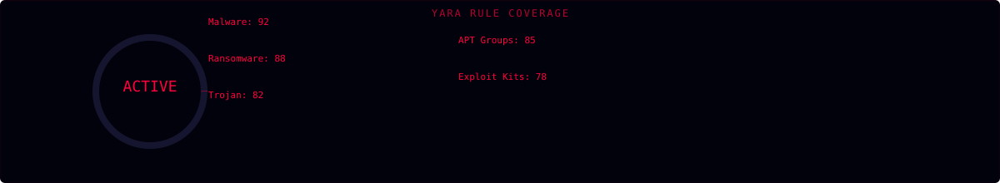
</picture>
<br>
<picture>
  <source media="(prefers-color-scheme: dark)" srcset="assets/sigma-rules.svg">
  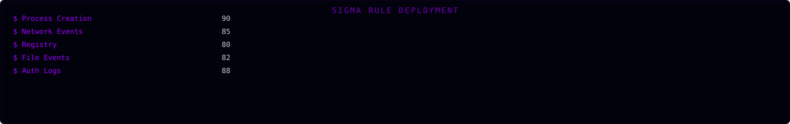
</picture>
<br>
<picture>
  <source media="(prefers-color-scheme: dark)" srcset="assets/hunt-maturity.svg">
  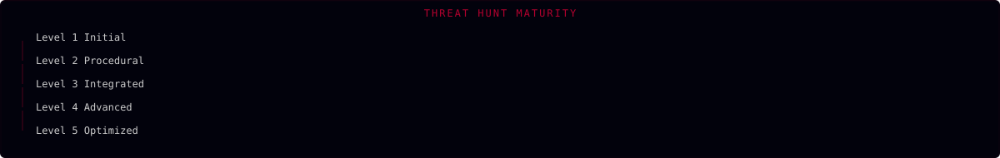
</picture>
<br>
<picture>
  <source media="(prefers-color-scheme: dark)" srcset="assets/hunt-hypothesis.svg">
  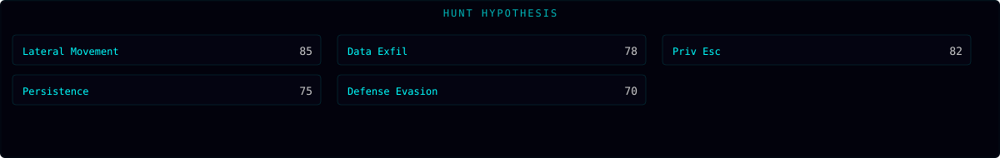
</picture>
<br>
<picture>
  <source media="(prefers-color-scheme: dark)" srcset="assets/hunt-sources.svg">
  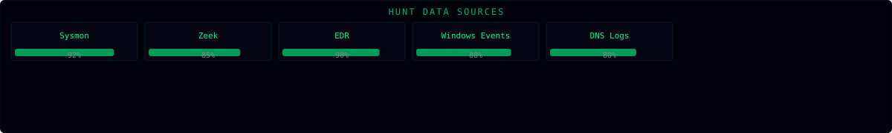
</picture>
<br>
<picture>
  <source media="(prefers-color-scheme: dark)" srcset="assets/detection-gaps.svg">
  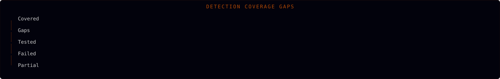
</picture>
<br>
<picture>
  <source media="(prefers-color-scheme: dark)" srcset="assets/malware-static.svg">
  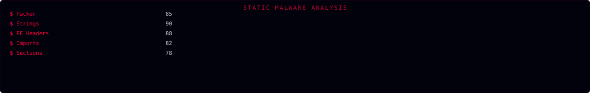
</picture>
<br>
<picture>
  <source media="(prefers-color-scheme: dark)" srcset="assets/malware-dynamic.svg">
  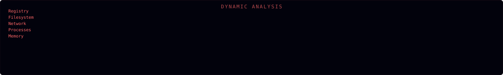
</picture>
<br>
<picture>
  <source media="(prefers-color-scheme: dark)" srcset="assets/ransomware-tactics.svg">
  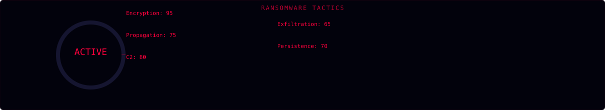
</picture>
<br>
<picture>
  <source media="(prefers-color-scheme: dark)" srcset="assets/apt-groups.svg">
  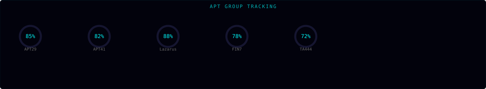
</picture>
<br>
<picture>
  <source media="(prefers-color-scheme: dark)" srcset="assets/privileged-access.svg">
  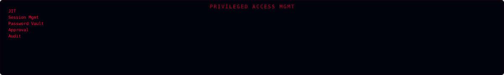
</picture>
<br>
<picture>
  <source media="(prefers-color-scheme: dark)" srcset="assets/identity-governance.svg">
  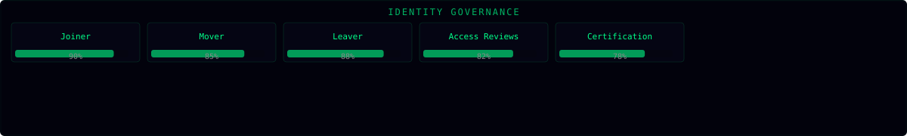
</picture>
<br>
<picture>
  <source media="(prefers-color-scheme: dark)" srcset="assets/zero-trust-network.svg">
  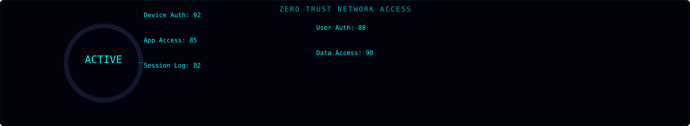
</picture>
<br>
<picture>
  <source media="(prefers-color-scheme: dark)" srcset="assets/badge-access.svg">
  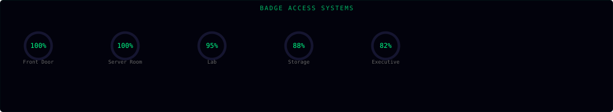
</picture>
<br>
<picture>
  <source media="(prefers-color-scheme: dark)" srcset="assets/data-center-sec.svg">
  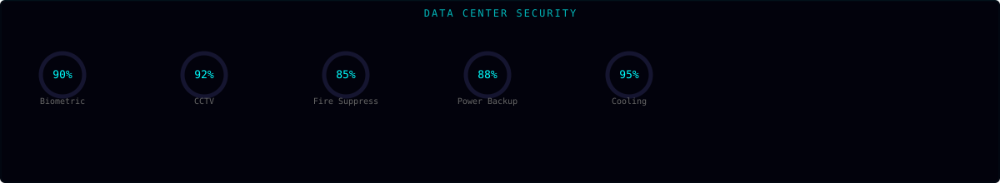
</picture>
<br>
<picture>
  <source media="(prefers-color-scheme: dark)" srcset="assets/physical-security.svg">
  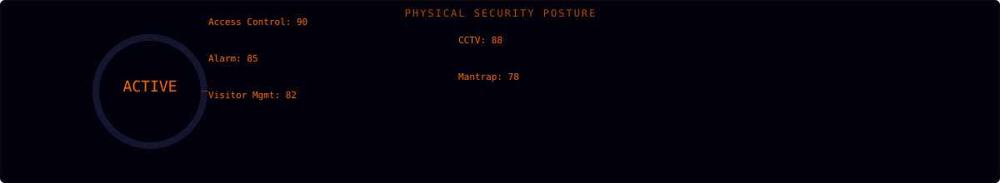
</picture>
<br>
<picture>
  <source media="(prefers-color-scheme: dark)" srcset="assets/mobile-threats.svg">
  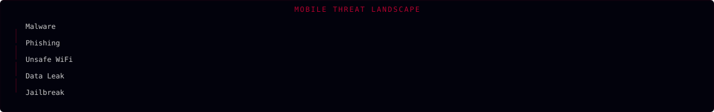
</picture>
<br>
<picture>
  <source media="(prefers-color-scheme: dark)" srcset="assets/mdm-compliance.svg">
  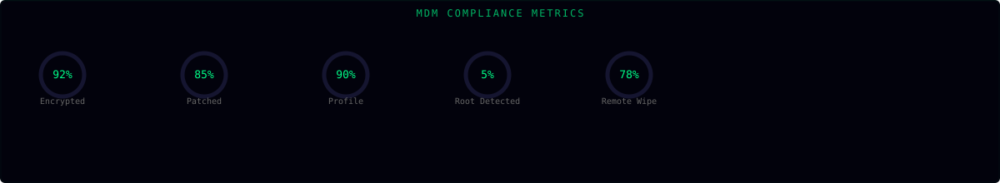
</picture>
<br>
<picture>
  <source media="(prefers-color-scheme: dark)" srcset="assets/insurance-coverage.svg">
  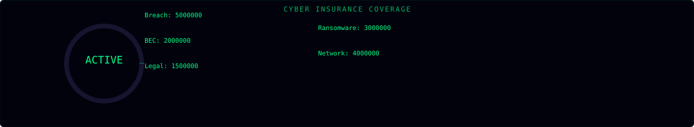
</picture>
<br>
<picture>
  <source media="(prefers-color-scheme: dark)" srcset="assets/incident-cost.svg">
  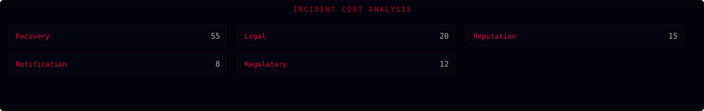
</picture>
<br>
<picture>
  <source media="(prefers-color-scheme: dark)" srcset="assets/breach-notification.svg">
  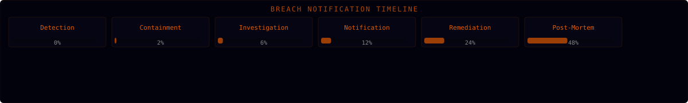
</picture>
<br>
<picture>
  <source media="(prefers-color-scheme: dark)" srcset="assets/war-room.svg">
  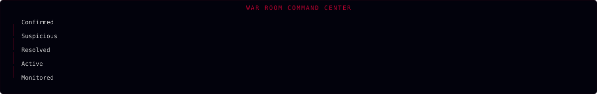
</picture>
<br>
<picture>
  <source media="(prefers-color-scheme: dark)" srcset="assets/incident-playbooks.svg">
  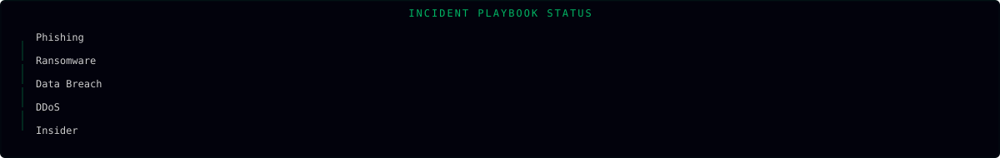
</picture>
<br>
<picture>
  <source media="(prefers-color-scheme: dark)" srcset="assets/incident-timeline.svg">
  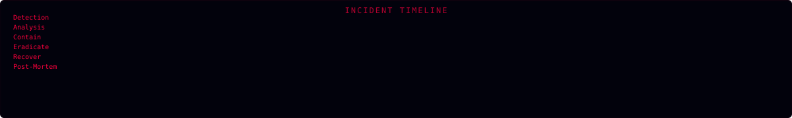
</picture>
<br>
<picture>
  <source media="(prefers-color-scheme: dark)" srcset="assets/lessons-learned.svg">
  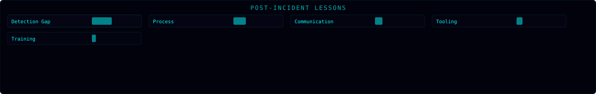
</picture>
<br>
<picture>
  <source media="(prefers-color-scheme: dark)" srcset="assets/stix-patterns.svg">
  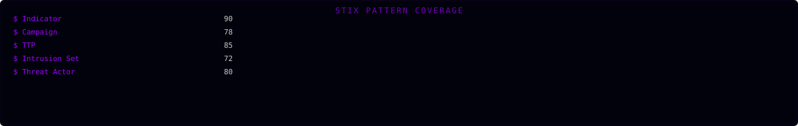
</picture>
<br>
<picture>
  <source media="(prefers-color-scheme: dark)" srcset="assets/threat-sharing.svg">
  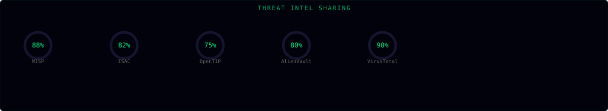
</picture>
<br>
<picture>
  <source media="(prefers-color-scheme: dark)" srcset="assets/ttps-mapped.svg">
  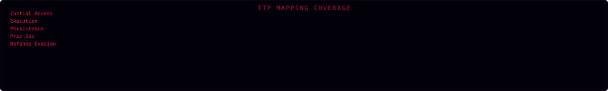
</picture>
<br>
<picture>
  <source media="(prefers-color-scheme: dark)" srcset="assets/osint-dashboard.svg">
  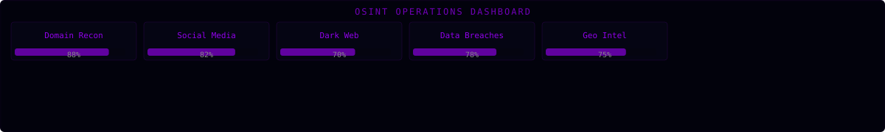
</picture>
<br>
<picture>
  <source media="(prefers-color-scheme: dark)" srcset="assets/threat-landscape.svg">
  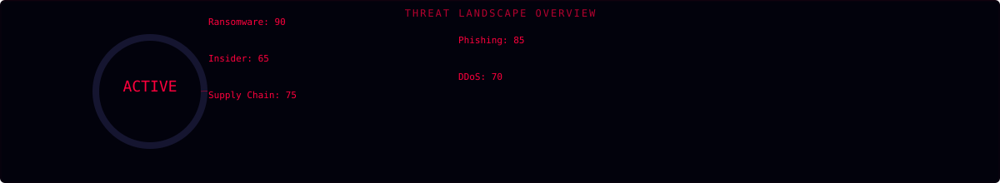
</picture>
<br>
<picture>
  <source media="(prefers-color-scheme: dark)" srcset="assets/osint-framework.svg">
  
</picture>
<br>
<picture>
  <source media="(prefers-color-scheme: dark)" srcset="assets/capacity-planning.svg">
  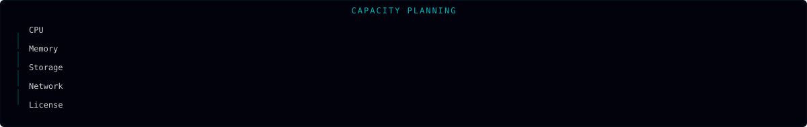
</picture>
<br>
<picture>
  <source media="(prefers-color-scheme: dark)" srcset="assets/storage-metrics.svg">
  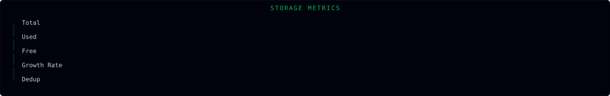
</picture>
<br>
<picture>
  <source media="(prefers-color-scheme: dark)" srcset="assets/db-security.svg">
  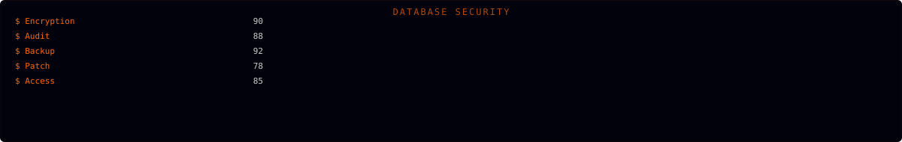
</picture>
<br>
<picture>
  <source media="(prefers-color-scheme: dark)" srcset="assets/vuln-scanners.svg">
  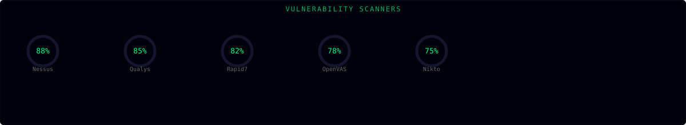
</picture>
<br>
<picture>
  <source media="(prefers-color-scheme: dark)" srcset="assets/vuln-remediation.svg">
  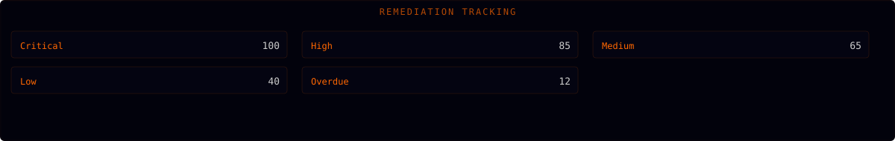
</picture>
<br>
<picture>
  <source media="(prefers-color-scheme: dark)" srcset="assets/patch-status.svg">
  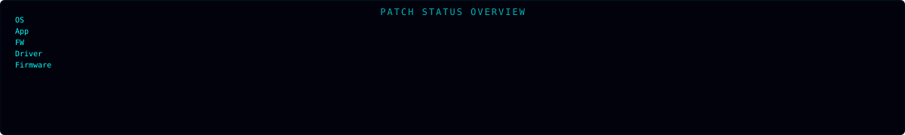
</picture>
<br>
<picture>
  <source media="(prefers-color-scheme: dark)" srcset="assets/exploit-mitigation.svg">
  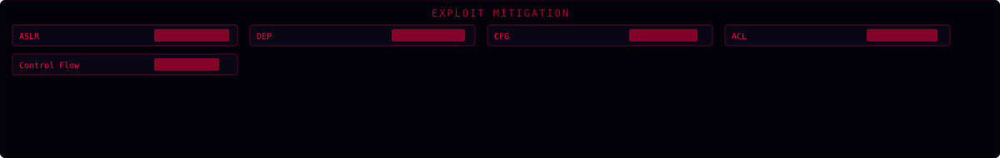
</picture>
<br>
<picture>
  <source media="(prefers-color-scheme: dark)" srcset="assets/ci-cd-security.svg">
  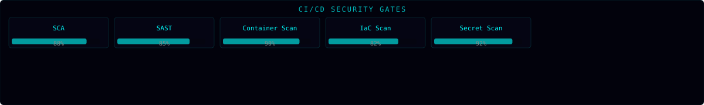
</picture>
<br>
<picture>
  <source media="(prefers-color-scheme: dark)" srcset="assets/pipeline-metrics.svg">
  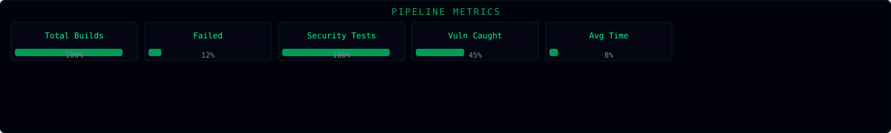
</picture>
<br>
<picture>
  <source media="(prefers-color-scheme: dark)" srcset="assets/artifact-security.svg">
  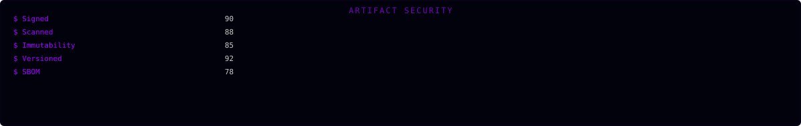
</picture>
<br>
<picture>
  <source media="(prefers-color-scheme: dark)" srcset="assets/ai-threat-model.svg">
  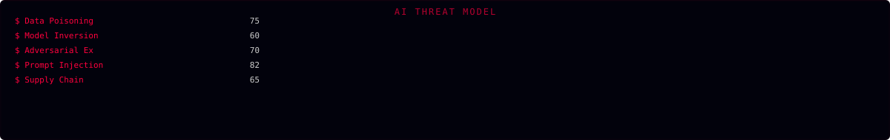
</picture>
<br>
<picture>
  <source media="(prefers-color-scheme: dark)" srcset="assets/ai-bias-metrics.svg">
  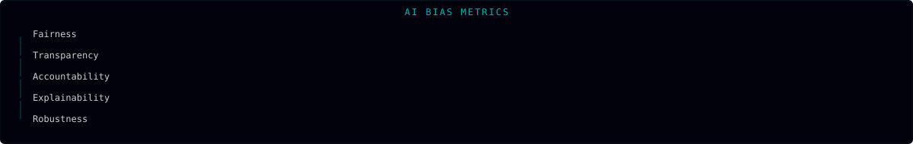
</picture>
<br>
<picture>
  <source media="(prefers-color-scheme: dark)" srcset="assets/ai-governance.svg">
  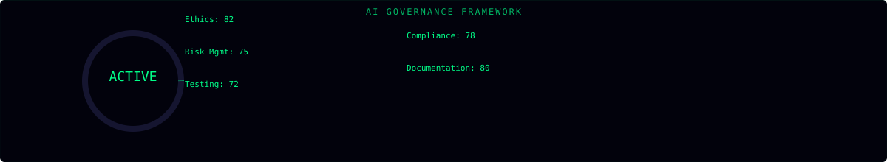
</picture>
<br>
<picture>
  <source media="(prefers-color-scheme: dark)" srcset="assets/llm-security.svg">
  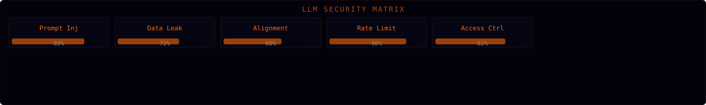
</picture>
<br>
<picture>
  <source media="(prefers-color-scheme: dark)" srcset="assets/quantum-threats.svg">
  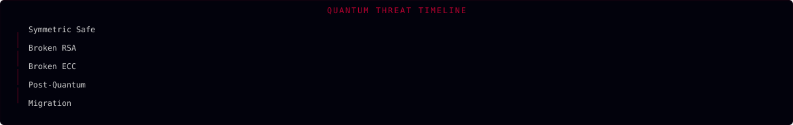
</picture>
<br>
<picture>
  <source media="(prefers-color-scheme: dark)" srcset="assets/pq-crypto.svg">
  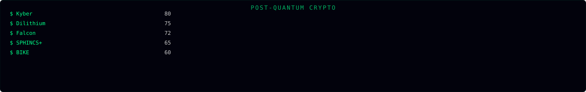
</picture>
<br>
<picture>
  <source media="(prefers-color-scheme: dark)" srcset="assets/iot-security.svg">
  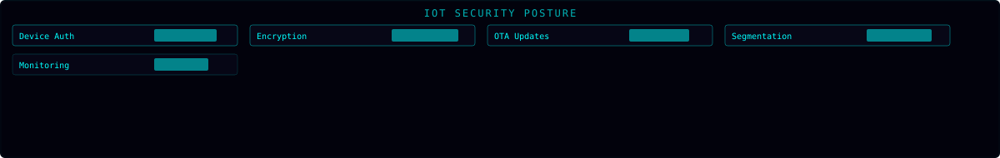
</picture>
<br>
<picture>
  <source media="(prefers-color-scheme: dark)" srcset="assets/firmware-security.svg">
  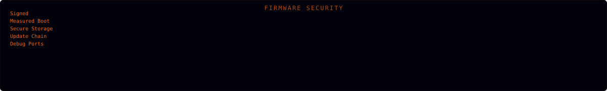
</picture>
<br>
<picture>
  <source media="(prefers-color-scheme: dark)" srcset="assets/ics-scada.svg">
  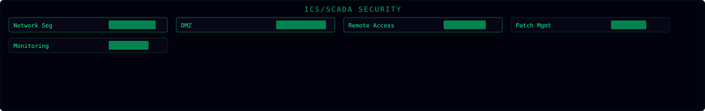
</picture>
<br>
<picture>
  <source media="(prefers-color-scheme: dark)" srcset="assets/automation-framework.svg">
  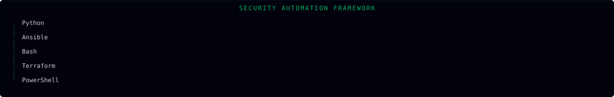
</picture>
<br>
<picture>
  <source media="(prefers-color-scheme: dark)" srcset="assets/log-collection.svg">
  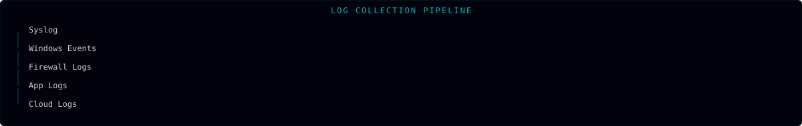
</picture>
<br>
<picture>
  <source media="(prefers-color-scheme: dark)" srcset="assets/elk-stack.svg">
  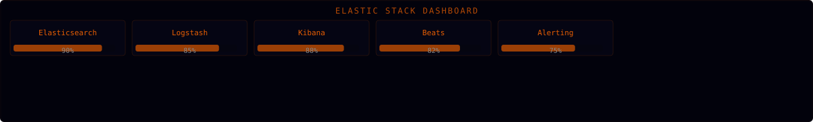
</picture>
<br>
<picture>
  <source media="(prefers-color-scheme: dark)" srcset="assets/research-workflow.svg">
  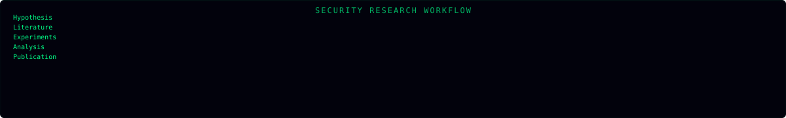
</picture>
<br>
<picture>
  <source media="(prefers-color-scheme: dark)" srcset="assets/tool-benchmark.svg">
  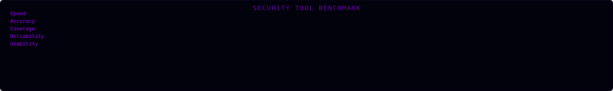
</picture>
<br>
<picture>
  <source media="(prefers-color-scheme: dark)" srcset="assets/reverse-engineering.svg">
  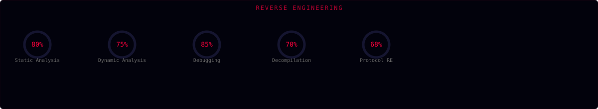
</picture>
<br>
<picture>
  <source media="(prefers-color-scheme: dark)" srcset="assets/binary-exploitation.svg">
  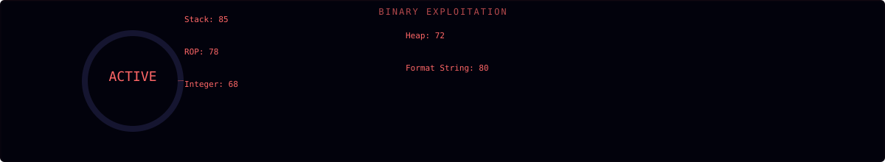
</picture>
<br>
<picture>
  <source media="(prefers-color-scheme: dark)" srcset="assets/bug-bounty-platforms.svg">
  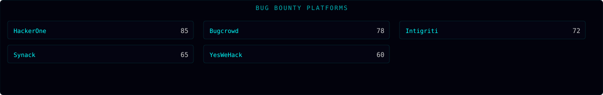
</picture>
<br>
<picture>
  <source media="(prefers-color-scheme: dark)" srcset="assets/cve-research.svg">
  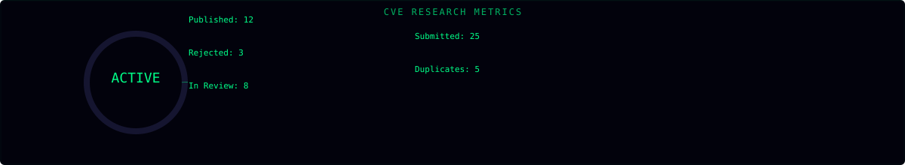
</picture>
<br>
<picture>
  <source media="(prefers-color-scheme: dark)" srcset="assets/exploit-db.svg">
  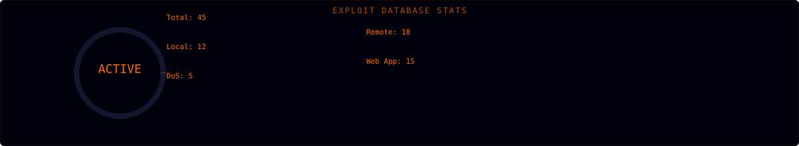
</picture>
<br>
<picture>
  <source media="(prefers-color-scheme: dark)" srcset="assets/capture-the-flag.svg">
  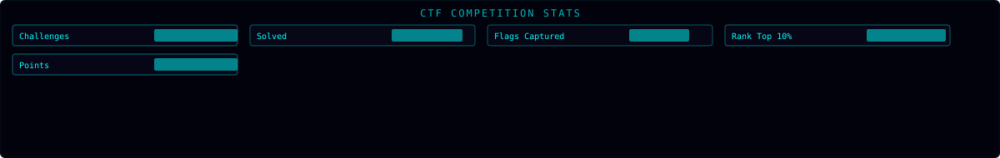
</picture>
<br>
<picture>
  <source media="(prefers-color-scheme: dark)" srcset="assets/password-cracking.svg">
  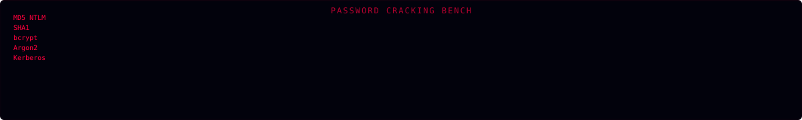
</picture>
<br>
<picture>
  <source media="(prefers-color-scheme: dark)" srcset="assets/wireless-attacks.svg">
  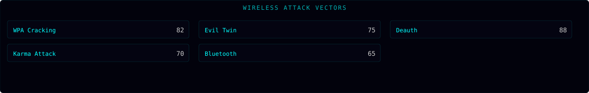
</picture>
<br>
<picture>
  <source media="(prefers-color-scheme: dark)" srcset="assets/web-application-firewall.svg">
  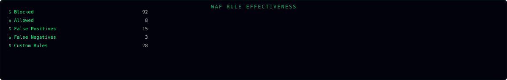
</picture>
<br>
<picture>
  <source media="(prefers-color-scheme: dark)" srcset="assets/ip-blocklist.svg">
  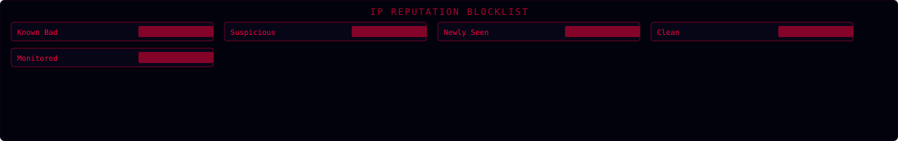
</picture>
<br>
<picture>
  <source media="(prefers-color-scheme: dark)" srcset="assets/email-security.svg">
  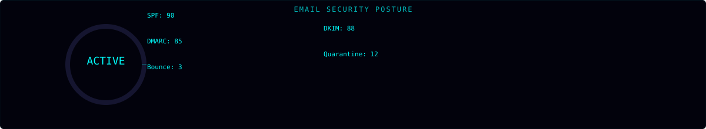
</picture>
<br>
<picture>
  <source media="(prefers-color-scheme: dark)" srcset="assets/ransomware-readiness.svg">
  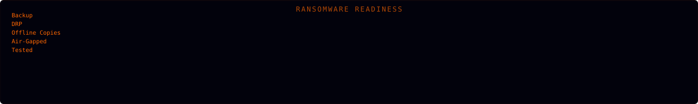
</picture>
<br>
<picture>
  <source media="(prefers-color-scheme: dark)" srcset="assets/access-portal.svg">
  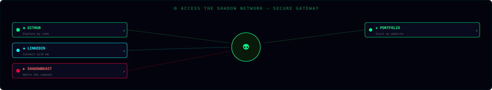
</picture>
<br>
<picture>
  <source media="(prefers-color-scheme: dark)" srcset="assets/mastery-metrics.svg">
  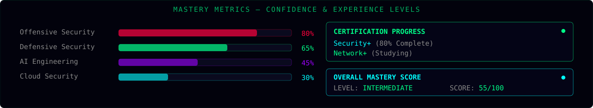
</picture>
<br>
<picture>
  <source media="(prefers-color-scheme: dark)" srcset="assets/cert-path.svg">
  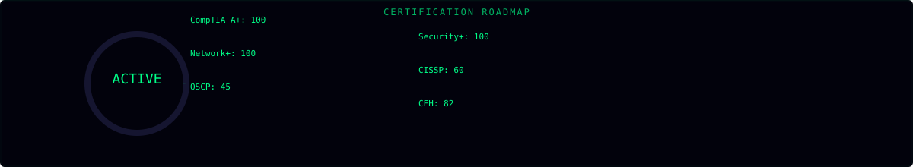
</picture>
<br>
<picture>
  <source media="(prefers-color-scheme: dark)" srcset="assets/career-progression.svg">
  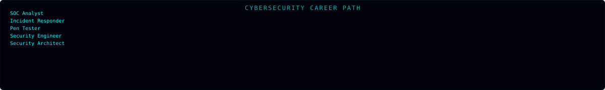
</picture>
<br>
<picture>
  <source media="(prefers-color-scheme: dark)" srcset="assets/training-matrix.svg">
  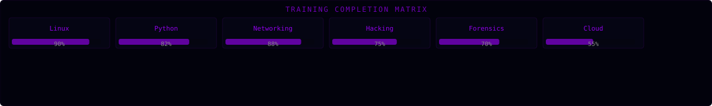
</picture>
<br>
<picture>
  <source media="(prefers-color-scheme: dark)" srcset="assets/linux-hardening.svg">
  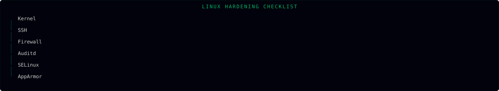
</picture>
<br>
<picture>
  <source media="(prefers-color-scheme: dark)" srcset="assets/windows-hardening.svg">
  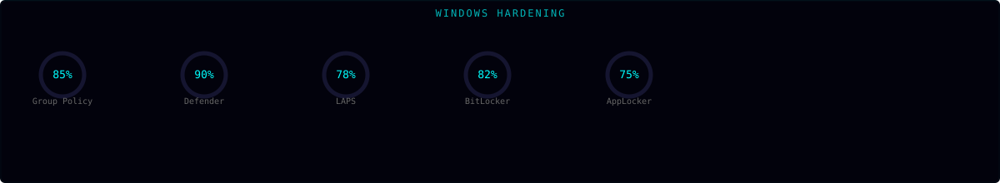
</picture>
<br>
<picture>
  <source media="(prefers-color-scheme: dark)" srcset="assets/docker-hardening.svg">
  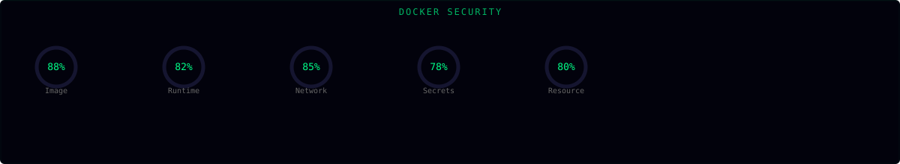
</picture>
<br>
<picture>
  <source media="(prefers-color-scheme: dark)" srcset="assets/daily-cycle.svg">
  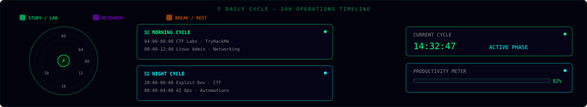
</picture>
<br>
<picture>
  <source media="(prefers-color-scheme: dark)" srcset="assets/weekly-cycles.svg">
  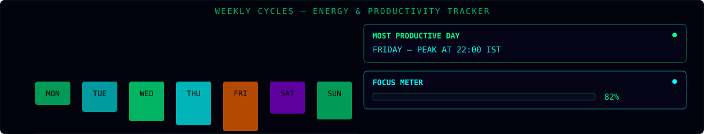
</picture>
<br>
<picture>
  <source media="(prefers-color-scheme: dark)" srcset="assets/social-hub.svg">
  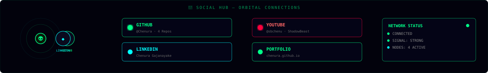
</picture>
<br>
<picture>
  <source media="(prefers-color-scheme: dark)" srcset="assets/community-network.svg">
  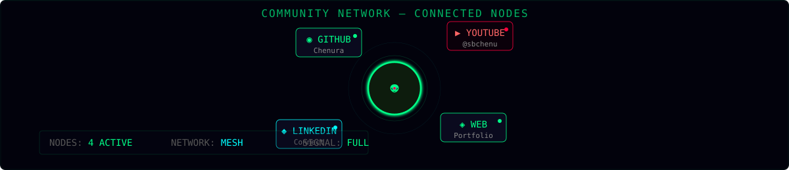
</picture>
<br>
<picture>
  <source media="(prefers-color-scheme: dark)" srcset="assets/location-ping.svg">
  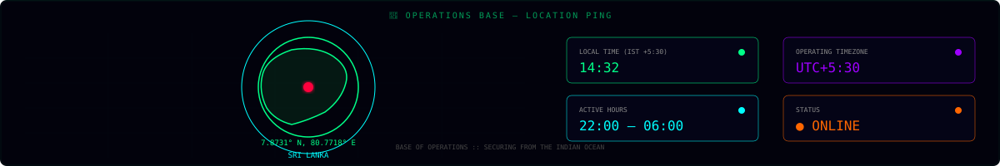
</picture>
<br>
<picture>
  <source media="(prefers-color-scheme: dark)" srcset="assets/hardware-backend.svg">
  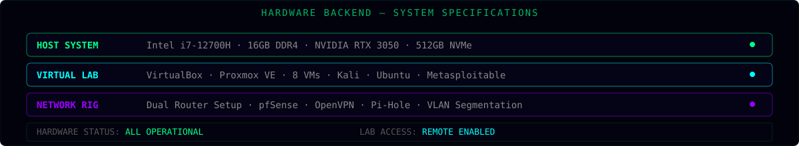
</picture>
<br>
<picture>
  <source media="(prefers-color-scheme: dark)" srcset="assets/backup-status.svg">
  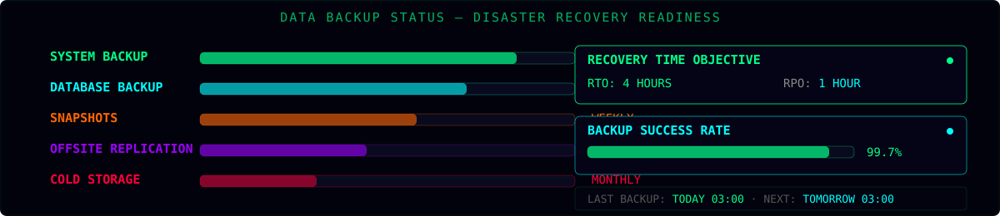
</picture>
<br>
<picture>
  <source media="(prefers-color-scheme: dark)" srcset="assets/os-hardening.svg">
  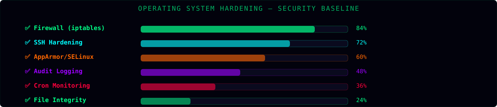
</picture>
<br>
<picture>
  <source media="(prefers-color-scheme: dark)" srcset="assets/daily-standup.svg">
  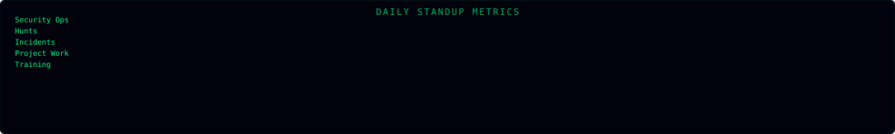
</picture>
<br>
<picture>
  <source media="(prefers-color-scheme: dark)" srcset="assets/security-hygiene.svg">
  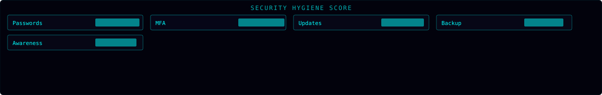
</picture>
<br>
<picture>
  <source media="(prefers-color-scheme: dark)" srcset="assets/quote-carousel.svg">
  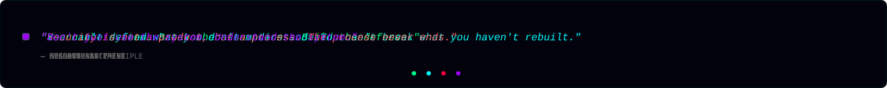
</picture>
<br>
<picture>
  <source media="(prefers-color-scheme: dark)" srcset="assets/core-values.svg">
  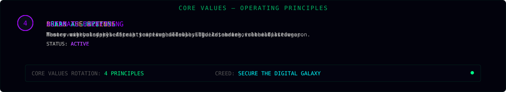
</picture>
<br>
<picture>
  <source media="(prefers-color-scheme: dark)" srcset="assets/incident-log.svg">
  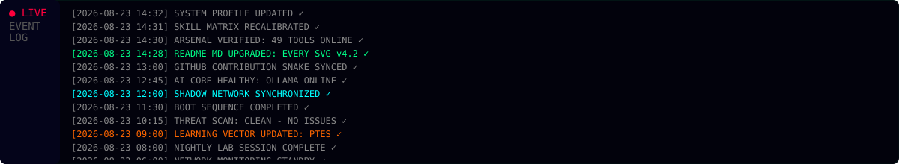
</picture>
<br>
<picture>
  <source media="(prefers-color-scheme: dark)" srcset="assets/security-audit-log.svg">
  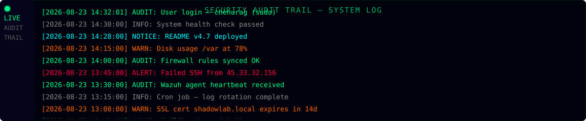
</picture>
<br>
<picture>
  <source media="(prefers-color-scheme: dark)" srcset="assets/alert-console.svg">
  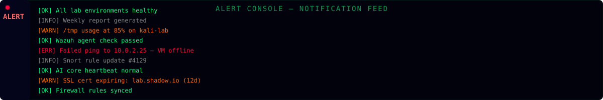
</picture>
<br>
<picture>
  <source media="(prefers-color-scheme: dark)" srcset="assets/activity-graph-panel.svg">
  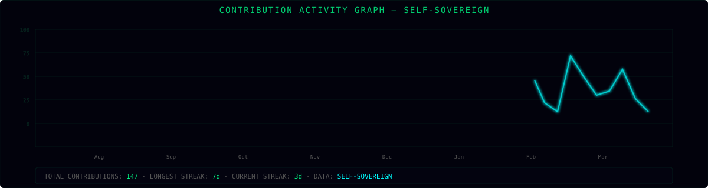
</picture>
<br>
<picture>
  <source media="(prefers-color-scheme: dark)" srcset="assets/mascot-terminal.svg">
  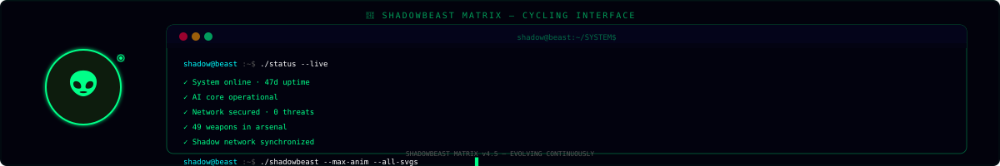
</picture>
<br>
<picture>
  <source media="(prefers-color-scheme: dark)" srcset="assets/final-transmission.svg">
  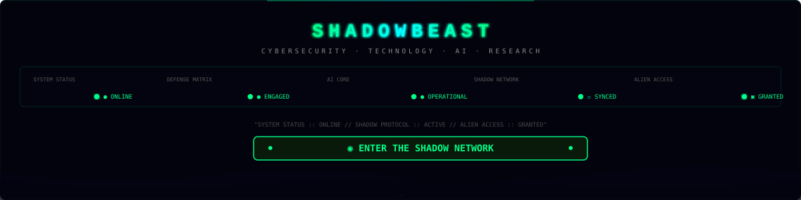
</picture>
<br>


---

```
╔══════════════════════════════════════════════════════════════════╗
║                    GITHUB OPERATIONS                            ║
╚══════════════════════════════════════════════════════════════════╝
```

[](https://github.com/chenurag)

[](https://github.com/chenurag)
[](https://git.io/streak-stats)

[](https://github.com/chenurag)
<picture>
  <source media="(prefers-color-scheme: dark)" srcset="assets/activity-graph-panel.svg">
  
</picture>
<br>

[](https://github.com/ryo-ma/github-profile-trophy)

---

<details>
<summary><b>📜 SESSION TRANSCRIPT ARCHIVE</b></summary>
<br>

```
┌──────────────────────────────────────────┐
│ SESSION LOG — v8.1 DEPLOYMENT            │
├──────────────────────────────────────────┤
│ 2026-08-23  initial commit               │
│ 2026-08-23  v4.0: 4 SVGs + hero         │
│ 2026-08-23  v4.1-v4.7: 56 SVGs          │
│ 2026-08-23  v4.8: 64 SVGs               │
│ 2026-08-23  v6.0: 72 SVGs               │
│ 2026-08-23  v7.0: 80 SVGs               │
│ 2026-08-26  v8.0: 154 SVGs              │
│ 2026-08-26  v8.1: 259 SVGs              │
│                                          │
│ STATUS: 🚀 FULLY DEPLOYED                │
└──────────────────────────────────────────┘
```

</details>

[](https://github.com/chenurag)
[](https://github.com/chenurag)
