<picture>
  <source media="(prefers-color-scheme: dark)" srcset="assets/hero-matrix.svg">
  
</picture>

 

<pre>
╔══════════════════════════════════════════════════════════════════════════╗
║  👽 ALIEN PROTOCOL :: CHENURA GAJANAYAKE                              ║
║  ─────────────────────────────────────────────────────────────────────  ║
║  CLASS: CYBERSECURITY ENGINEER (IN TRAINING)    STATUS: ● ONLINE       ║
║  ROLE:  SOC ANALYST • ETHICAL HACKER            ACCESS: ALIEN LEVEL    ║
║  FOCUS: LINUX • NETWORKING • PYTHON • AI        MISSION: SECURE THE    ║
║         THREAT INTEL • OSINT • CLOUD                    DIGITAL DOMAIN ║
║  ─────────────────────────────────────────────────────────────────────  ║
║  [████████████████████████████████████████████████████████░░░░] 87%     ║
╚══════════════════════════════════════════════════════════════════════════╝
</pre>

---

## 🛰️ QUANTUM NAVIGATION — MAINFRAME ACCESS

  

---

## 👽 ALIEN IDENTITY — SYSTEM ACQUISITION

<pre>
CORE DIRECTIVE:  LEARN  →  BUILD  →  TEST  →  UNDERSTAND  →  DEFEND  →  AUTOMATE
SECONDARY:       DISCOVER → ENUMERATE → ANALYZE → EXPLOIT → PATCH → HARDEN  
TERTIARY:        RESEARCH → DEVELOP → DEPLOY → MONITOR → ITERATE
</pre>

> **`INIT SEQUENCE: SHADOWBEAST PROTOCOL v3.0`**
>
> Welcome to my digital operations center. I'm **Chenura Gajanayake** — a cybersecurity undergraduate from Sri Lanka operating at the intersection of offensive security, Linux engineering, AI automation, and threat intelligence. I reverse systems to understand their failure modes, then re-harden them.
>
> **Philosophy:** *You can't defend what you don't understand. You can't break what you haven't rebuilt.*

### 📡 ACTIVE SENSOR FEED

| Sensor | Signal Processing | Status |
|-------|------------------|--------|
| 🔐 **Cybersecurity** | SOC Operations · Threat Analysis · Ethical Hacking · Forensics | 🟢 ONLINE |
| 🐧 **Linux** | Kali · Ubuntu · Arch · Debian · Proxmox · System Hardening | 🟢 ONLINE |
| 🌐 **Networking** | TCP/IP Stack · DNS · Traffic Analysis · IDS/IPS · SDN | 🟢 ONLINE |
| 🐍 **Python** | Security Automation · Tool Development · AI Integration | 🔵 EXPANDING |
| 🤖 **AI/ML** | Ollama · Whisper · LangChain · Local LLM Inference | 🟡 RESEARCH |
| 🕵️ **OSINT** | Recon-ng · Maltego · Shodan · Google Dorking · Intel Gathering | 🔵 EXPANDING |
| 🛡️ **SOC** | SIEM (Wazuh/Splunk) · Log Analysis · Incident Response | 🟠 TRAINING |
| 🔬 **Forensics** | Autopsy · Volatility · File Carving · Memory Analysis | 🟡 RESEARCH |
| ☁️ **Cloud** | AWS · Docker · Container Security · IAM Policy | 🟣 EXPLORING |

---

## 🧬 TECHNOLOGY DNA — CORE ARCHITECTURE

<picture>
  <source media="(prefers-color-scheme: dark)" srcset="assets/skills-gauge.svg">
  
</picture>

### 🖥️ LANGUAGES & RUNTIMES

### 🐧 PLATFORMS

### 🔧 ENGINEERING STACK

---

## ☠️ CYBERSECURITY ARSENAL — WEAPONS & COUNTERMEASURES

<pre>
┌──────────────────────────────────────────────────────────────────────────────────┐
│                         SHADOWBEAST — SECURITY MATRIX                            │
├─────────────────┬──────────────────────┬──────────────────────┬─────────────────┤
│    RECONNAISSANCE│    EXPLOITATION     │     DEFENSE          │    ANALYSIS      │
├─────────────────┼──────────────────────┼──────────────────────┼─────────────────┤
│  Nmap           │  Metasploit          │  Snort IDS           │  Wireshark       │
│  Recon-ng       │  Hydra               │  Suricata            │  Tcpdump         │
│  theHarvester   │  John the Ripper     │  Wazuh SIEM          │  Burp Suite      │
│  Shodan         │  Hashcat             │  Osquery             │  Autopsy         │
│  Amass          │  SQLMap              │  Fail2ban            │  Volatility      │
│  Sublist3r      │  Searchsploit        │  RKHunter            │  Binwalk         │
│  Maltego        │  BetterCAP           │  Lynis               │  Steghide        │
│  Masscan        │  Responder           │  AppArmor            │  DNSChef         │
└─────────────────┴──────────────────────┴──────────────────────┴─────────────────┘
</pre>

### 🔬 CAPABILITIES MATRIX

| Domain | Tools & Methodologies | Proficiency |
|-------|---------------------|:----------:|
| **Network Recon & Mapping** | Nmap, Masscan, Zmap, Wireshark, tcpdump, BetterCAP, Netcat | `██████████` 95% |
| **Vulnerability Assessment** | OpenVAS, Nikto, Nessus, Burp Scanner, OWASP ZAP, Nuclei | `████████░░` 80% |
| **Web Application Testing** | Burp Suite, OWASP Top 10, XSS, SQLi, CSRF, SSRF, API Security | `████████░░` 80% |
| **Exploitation & Post-Exploit** | Metasploit, Searchsploit, Custom Payloads, PE, Lateral Movement | `███████░░░` 70% |
| **SOC / SIEM Operations** | Wazuh, Splunk, ELK Stack, Log Analysis, Incident Response Playbooks | `███████░░░` 70% |
| **Digital Forensics & IR** | Autopsy, Volatility, Binwalk, Steghide, File Carving, Timeline Analysis | `███████░░░` 70% |
| **OSINT & Threat Intelligence** | Maltego, Recon-ng, theHarvester, Google Dorking, Shodan, CVE Research | `████████░░` 80% |
| **Linux Hardening & Audit** | SELinux, AppArmor, Auditd, Lynis, CIS Benchmarks, Chkrootkit | `██████████` 90% |
| **Password Cracking** | Hashcat, John the Ripper, Hydra, Medusa, Crunch, Rules-Based | `███████░░░` 70% |
| **Wireless Security** | Aircrack-ng, Kismet, Reaver, Wifite, WPA/WPA2 Analysis | `██████░░░░` 60% |
| **Cloud Security** | AWS IAM, Docker Security, Container Scanning, Secret Detection | `█████░░░░░` 50% |
| **Malware Analysis** | Static Analysis, PE Structure, YARA Rules, Sandboxing | `█████░░░░░` 50% |

---

## 🧪 SHADOW LAB — CLOSED-LOOP RANGE

> *Virtual cyber range for adversarial simulation, security research, and defensive playbook development. All testing conducted exclusively against authorized environments.*

<picture>
  <source media="(prefers-color-scheme: dark)" srcset="assets/network-topo.svg">
  
</picture>

<pre>
┌────────────────────────────────────────────────────────────────────────────────┐
│                          SHADOW LAB — OPERATIONAL DIVISIONS                     │
├──────────────┬──────────────────┬─────────────────────┬────────────────────────┤
│  OFFENSIVE   │   DEFENSIVE      │    RESEARCH          │    TRAINING            │
├──────────────┼──────────────────┼─────────────────────┼────────────────────────┤
│  Kali Linux  │  Wazuh SIEM      │  Ollama AI Suite    │  TryHackMe (THM)       │
│  Parrot OS   │  Snort IDS       │  Whisper STT        │  HackTheBox (HTB)      │
│  Metasploit  │  Suricata IPS    │  LangChain Agents   │  VulnHub               │
│  Burp Suite  │  Osquery         │  Custom Toolchain   │  DVWA / Juice Shop     │
│  Nmap Suite  │  Grafana/Prom    │  Local LLM Deploy   │  PicoCTF / OverTheWire │
│  Responder   │  Fail2ban        │  Python Automation  │  Offensive Security    │
│  Empire/C2   │  Wireshark       │  Data Pipeline      │  HTB Academy           │
└──────────────┴──────────────────┴─────────────────────┴────────────────────────┘
</pre>

### 📦 LAB COMPONENT CATALOG

| Class | Systems | Purpose |
|------|---------|---------|
| 🖥️ **Hypervisor** | VirtualBox, Proxmox VE | VM orchestration, snapshots, isolated networking |
| 🐧 **Attack Platform** | Kali Linux, Parrot OS | Offensive security, tool suite, custom scripts |
| 🎯 **Target VMs** | Metasploitable, DVWA, VulnHub, Windows AD Lab, Ubuntu Server | Vulnerability testing & exploitation practice |
| 📡 **Network Lab** | pfSense, OPNsense, Open vSwitch, GNS3 (planned) | Routing, firewalls, network segmentation |
| ☠️ **Exploitation Rack** | Metasploit, Empire, Covenant, Cobalt Strike, Hydra, SQLMap | Full kill-chain simulation |
| 🛡️ **Defense Stack** | Snort, Suricata, Wazuh, osquery, Fail2ban, RKHunter, ClamAV | IDS/IPS, EDR, monitoring, compliance |
| 🔬 **Forensics Bench** | Autopsy, Volatility, Binwalk, Foremost, Bulk Extractor | Disk/memory analysis, data recovery |
| 🤖 **AI Operations** | Ollama, Whisper, LangChain, Python, GPT4All | Security automation, analysis, assistance |

---

## 🤖 AI × CYBERSECURITY — NEURAL INTERFACE

<pre>
                            ╭─────────────────────╮
                            │  ARTIFICIAL          │
                            │  INTELLIGENCE        │
                            ╰──────────┬──────────╯
                                       │
                     ┌─────────────────┼─────────────────┐
                     ▼                 ▼                 ▼
               AUTOMATION          ANALYSIS         ASSISTANCE
                     │                 │                 │
                     ▼                 ▼                 ▼
           ╔════════════════╗ ╔════════════════╗ ╔════════════════╗
           ║  SECURITY      ║ ║  THREAT        ║ ║  RESEARCH      ║
           ║  AUTOMATION    ║ ║  INTELLIGENCE  ║ ║  ASSISTANT     ║
           ╚════════════════╝ ╚════════════════╝ ╚════════════════╝
</pre>

### 🧠 SHADOWASSISTANT — AUTONOMOUS AI CORE

<pre>
┌──────────┐   ┌──────────┐   ┌──────────┐   ┌──────────┐   ┌──────────┐   ┌──────────┐
│ VOICE    │ → │ WHISPER  │ → │ OLLAMA   │ → │ COMMAND  │ → │ SYSTEM   │ → │ FEEDBACK │
│ INPUT    │   │ STT      │   │ LLM      │   │ ENGINE   │   │ RESPONSE │   │ LOOP     │
└──────────┘   └──────────┘   └──────────┘   └──────────┘   └──────────┘   └──────────┘
</pre>

**Stack:** Python · OpenAI Whisper · Ollama (Mistral, Llama 3, CodeLlama) · LangChain · Custom Security Toolchain · RAG Pipeline

### 🔭 AI APPLICATIONS — DEPLOYMENT STATUS

| Application | Stack | Status |
|------------|-------|--------|
| **Log Analysis Engine** | LLM-powered SIEM log parsing, anomaly scoring, alert enrichment | 🟢 OPERATIONAL |
| **Threat Intelligence** | CVE monitoring, threat feed aggregation, IOC extraction, context enrichment | 🟢 OPERATIONAL |
| **Security Automation** | Cron-driven playbooks, automated triage, report generation, Slack/Teams alerts | 🟢 OPERATIONAL |
| **Voice-Controlled Lab** | Whisper → Ollama → shell execution — hands-free security ops | 🔵 DEVELOPMENT |
| **CTF AI Assistant** | Challenge analysis, hint generation, technique identification (non-answer) | 🟡 EXPERIMENTAL |
| **Malware Analysis** | Static PE analysis, YARA generation, behavior classification, sandbox automation | 🟣 RESEARCH |

---

## 📡 NETWORK OPERATIONS — DEFENSE IN DEPTH

<pre>
                              ☁️ INTERNET — UNTRUSTED ZONE
                                   │
                                   ▼
                            ┌──────────┐
                            │  🔥 FW   │  EDGE FIREWALL — DROP ALL DENY DEFAULT
                            │          │  📜 POLICY: ACCEPT ESTABLISHED, ALLOW 443/80
                            └────┬─────┘
                                   │
                                   ▼
                            ┌──────────┐
                            │  🔀 RTR  │  CORE ROUTER — TRAFFIC ORCHESTRATION
                            │          │  🌐 192.168.1.0/24 · NAT · OSPF · DHCP
                            └────┬─────┘
                                   │
                                   ▼
                            ┌──────────┐
                            │  ⬡ SW   │  LAYER 2 SWITCH — DISTRIBUTION
                            │         │  🔗 VLANs (10,20,30) · STP · Port Sec
                            └────┬─────┘
                                   │
             ┌────────────────────┼────────────────────┐
             ▼                    ▼                    ▼
        ┌──────────┐        ┌──────────┐        ┌──────────┐
        │ 🖥️      │        │ 💻       │        │ 📦       │
        │ SERVER   │        │ PC       │        │ LAB VM   │
        │ PRESENCE │        │ KALI     │        │ TARGETS  │
        │ Linux    │        │ DEV/ADMIN│        │ VULNHUB  │
        └────┬─────┘        └────┬─────┘        └────┬─────┘
             └──────────────────┼────────────────────┘
                                ▼
                         ┌──────────┐
                         │  📊 SOC  │  SECURITY OPERATIONS CENTER
                         │          │  Wazuh · Grafana · Log Aggregation
                         └──────────┘
</pre>

### 🌐 NETWORK SKILLS

| Layer | Protocols & Technologies |
|------|------------------------|
| 🌐 **Core Protocols** | TCP/IP, UDP, DNS, DHCP, HTTP/HTTPS, TLS/SSL, ARP, ICMP, SNMP, SMTP |
| 🔀 **Routing & Switching** | OSPF, BGP (basic), VLANs, STP, EtherChannel, ACLs, NAT/PAT, Subnetting/VLSM |
| 📡 **Monitoring & Analysis** | Wireshark, tcpdump, NetFlow/sFlow, Ntopng, Zabbix, Grafana, Loki, Prometheus |
| 🛡️ **Network Security** | iptables/nftables, pfSense, Snort/Suricata rules, VPNs (WireGuard, OpenVPN), Network Segmentation |

---

## 🧠 OPERATIONAL DOCTRINE — SECURITY TENETS

<pre>
┌─────────────────────────────────────────────────────────────────────────────┐
│                         SHADOWBEAST — OPERATIONAL TENETS                    │
├─────────────────────────────────────────────────────────────────────────────┤
│                                                                             │
│  I.   LEARN THE SYSTEM      — Master every layer before attempting defense  │
│  II.  BREAK ASSUMPTIONS     — Edge cases are vulnerabilities; attack models │
│  III. BUILD THE DEFENSE     — Applied practice, not just theory             │
│  IV.  AUTOMATE EVERYTHING   — Scripts iterate flawlessly; humans don't      │
│  V.   DOCUMENT RELENTLESSLY — Unwritten knowledge is lost knowledge         │
│  VI.  SHARE THE KNOWLEDGE   — Security grows stronger through distribution  │
│  VII. NEVER STOP LEARNING   — The threat landscape evolves every 24 hours   │
│                                                                             │
└─────────────────────────────────────────────────────────────────────────────┘
</pre>

---

## 🚀 ACTIVE PROJECTS — CURRENT OPERATIONS

### 🤖 **ShadowAssistant** — AI-Powered Security Operations
> **STATUS:** DEPLOYED v0.4 · **LOCATION:** `~/shadow-assistant/`
>
> Autonomous voice-controlled security AI — combines Whisper speech recognition, Ollama LLM inference, and system command execution for hands-free security operations.

**Stack:** `Python` · `Whisper` · `Ollama` · `LangChain` · `Bash` · `Custom Toolchain`

### 🛡️ **Cybersecurity Learning Platform**
> **STATUS:** CONTINUOUS INTEGRATION · **SCOPE:** Full Kill Chain
>
> Complete personal cybersecurity ecosystem — structured labs, playbooks, knowledge base, toolchains covering the entire attack-to-defense spectrum.

**Coverage:** Networking · Linux · Ethical Hacking · Web Security · SOC Operations · Forensics · AI/ML

### 👽 **ShadowBeast (YouTube)**
> **STATUS:** ACTIVE · **CHANNEL:** `@sbchenu`
>
> Security research, Linux deep-dives, AI experimentation, and technology content.

---

## 🐍 CONTRIBUTION SNAKE — ACTIVITY FEED

  

---

## 📊 GITHUB COMMAND CENTER — PERFORMANCE METRICS

  

  

  

### 🏆 ACHIEVEMENT UNLOCKS

 

### 👽 LEVEL SYSTEM — PROGRESS TRACKER

<pre>
▣ CURRENT: LEVEL 87
  ═══════════════════════════════════════════════════════════════════░░░░░░  87%
  NEXT:    CYBER ARCHITECT (Lv 80) → ALIEN OVERLORD (Lv 100)
</pre>

---

## 🎯 STRATEGIC ROADMAP — 2026–2030

<pre>
YEAR  │  PHASE                     │  KEY MILESTONES                          │  STATUS
══════╪════════════════════════════╪═══════════════════════════════════════════╪══════════
2026  │  FOUNDATIONS               │  Linux & Networking Mastery              │ 🟢 COMPLETE
      │                            │  Ethical Hacking Fundamentals            │ 🟢 COMPLETE
      │                            │  Programming (Python/Bash/C/C++)         │ 🟢 COMPLETE
      │                            │  SOC Operations — Baseline               │ 🔄 PROGRESS
──────┼────────────────────────────┼───────────────────────────────────────────┼──────────
2027  │  SPECIALIZATION            │  SOC & Digital Forensics                 │ 🔜 QUEUED
      │                            │  Web Security & Bug Bounty               │ 🔜 QUEUED
      │                            │  Security Automation Pipeline             │ 🔜 QUEUED
      │                            │  CTF Competition Circuit                  │ 🔜 QUEUED
──────┼────────────────────────────┼───────────────────────────────────────────┼──────────
2028  │  ADVANCED ENGINEERING      │  Security Engineering (App/Network)      │ 🔜 QUEUED
      │                            │  Cloud Security (AWS/GCP)                │ 🔜 QUEUED
      │                            │  AI Security & ML Threat Detection       │ 🔜 QUEUED
      │                            │  Malware Analysis & Reverse Engineering   │ 🔜 QUEUED
──────┼────────────────────────────┼───────────────────────────────────────────┼──────────
2029  │  MASTERY & RESEARCH        │  Advanced Security Research               │ 🔜 QUEUED
      │                            │  Security Architecture & Design           │ 🔜 QUEUED
      │                            │  Open Source Security Tooling              │ 🔜 QUEUED
      │                            │  Client/Consulting Operations              │ 🔜 QUEUED
──────┼────────────────────────────┼───────────────────────────────────────────┼──────────
2030  │  COMMAND                   │  ──►  CYBERSECURITY ENGINEER             │ 🎯 TARGET
</pre>

---

## 🔥 CURRENT LEARNING VECTOR — ACTIVE RESEARCH

---

## 🧑‍💻 TERMINAL SESSION — INTERACTIVE SHELL

<pre>
shadow@beast:~$ ./shadowbeast --identify --verbose

╔══════════════════════════════════════════════════════════╗
║           SHADOWBEAST — SYSTEM IDENTIFICATION            ║
╠══════════════════════════════════════════════════════════╣
║  OPERATOR:        Chenura Gajanayake                    ║
║  ALIAS:           ShadowBeast                           ║
║  SECTOR:          Cybersecurity Engineering              ║
║  LOCATION:        Sri Lanka                             ║
║  STATUS:          ● ONLINE — FULLY OPERATIONAL          ║
╚══════════════════════════════════════════════════════════╝

[+] Loading security modules ................... COMPLETE
[+] Establishing defense perimeters ........... COMPLETE
[+] Initializing AI core ...................... OPERATIONAL
[+] Synchronizing shadow network .............. ACTIVE
[+] Running diagnostic suite .................. PASSED

shadow@beast:~$ cat /etc/shadowbeast/manifest.os

MISSION:  Secure the digital galaxy, one system at a time.
APPROACH: Understand → Break → Rebuild → Automate → Repeat
PHILOSOPHY: "Don't just use the system. Understand the system."
CREED:    "Learn the system. Break the assumptions. Build the defense."

shadow@beast:~$ ./shadowbeast --threat-assessment

[•] Current threat level:    LOW
[•] Defense posture:         STRONG — MULTI-LAYER
[•] Learning trajectory:     ACCELERATED
[•] System integrity:        100% — ALL SYSTEMS NOMINAL
[•] Mission readiness:       COMBAT EFFECTIVE

shadow@beast:~$ _
</pre>

---

## 🌐 ACCESS THE SHADOW NETWORK

  

<pre>
╔══════════════════════════════════════════════════════════════════════════╗
║                                                                          ║
║                    ///  SHADOW NETWORK :: ONLINE  \\\                     ║
║                                                                          ║
║          ACCESS: GRANTED          PROTOCOL: ALIEN LEVEL                  ║
║                                                                          ║
║                LEARN  •  BUILD  •  SECURE  •  REPEAT                    ║
║                                                                          ║
║                 >>>  SEE YOU IN THE NEXT SYSTEM  <<<                     ║
║                                                                          ║
║                                       👽                                 ║
╚══════════════════════════════════════════════════════════════════════════╝
</pre>

 

---

## 💀 FINAL TRANSMISSION

👽 **SHADOWBEAST** — CYBERSECURITY · TECHNOLOGY · AI · RESEARCH

<pre>
████████████████████████████████████████████████████████████████████████████
█  SYSTEM STATUS  :  ●  O N L I N E     //  SHADOW PROTOCOL : ACTIVE     █
█  DEFENSE MATRIX :  ▣  E N G A G E D   //  AI CORE         : ONLINE     █
█  SHADOW NETWORK :  ⊞  S Y N C E D     //  ALIEN ACCESS    : GRANTED    █
████████████████████████████████████████████████████████████████████████████
</pre>

 

  

**`"SYSTEM STATUS :: ONLINE  //  SHADOW PROTOCOL :: ACTIVE  //  ALIEN ACCESS :: GRANTED"`**

  

<picture>
  <source media="(prefers-color-scheme: dark)" srcset="https://capsule-render.vercel.app/api?type=waving&color=gradient&customColorList=2,12,24&height=120&section=footer">
  
</picture>

---

<b>📜 SESSION LOG — TRANSCRIPT ARCHIVE</b>

<pre>
[2026-08-23]  v3.0  GOD_MODE — hero-matrix.svg, zero copy buttons, full arsenal
[2026-08-23]  v2.0  NEXUS — Animated HUD, skills gauge, network topology
[2026-08-22]  v1.0  INIT — Shadow Network established, snake workflow activated

◆ NEXT UPGRADE: 4D holographic profile viz / live contribution dashboard
◆ SYSTEM CONTINUOUSLY EVOLVING — STAY TUNED
</pre>

